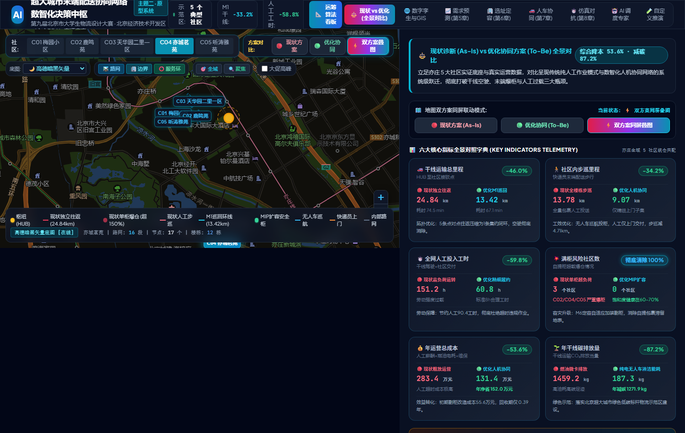
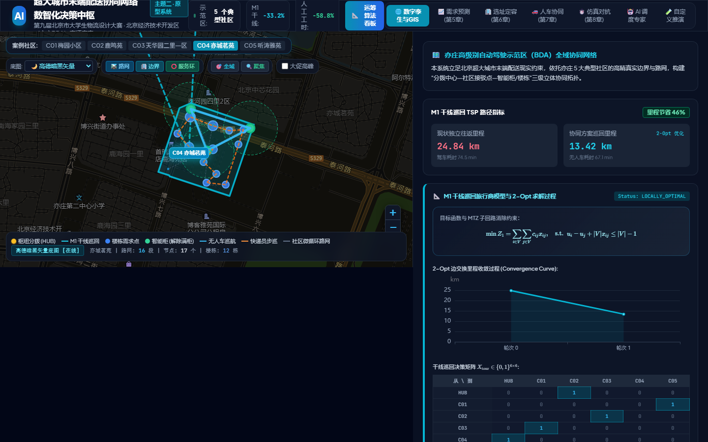
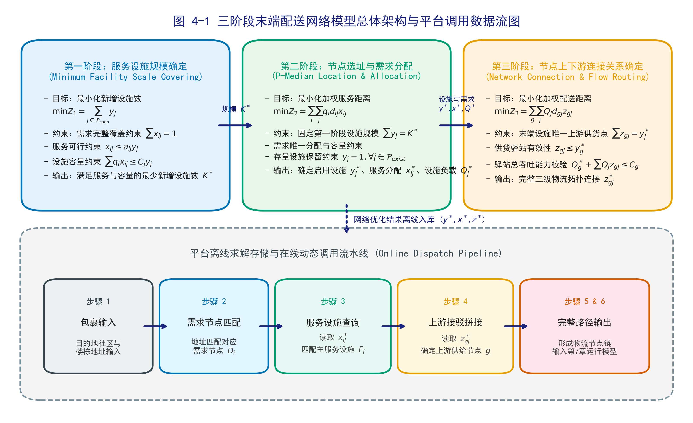
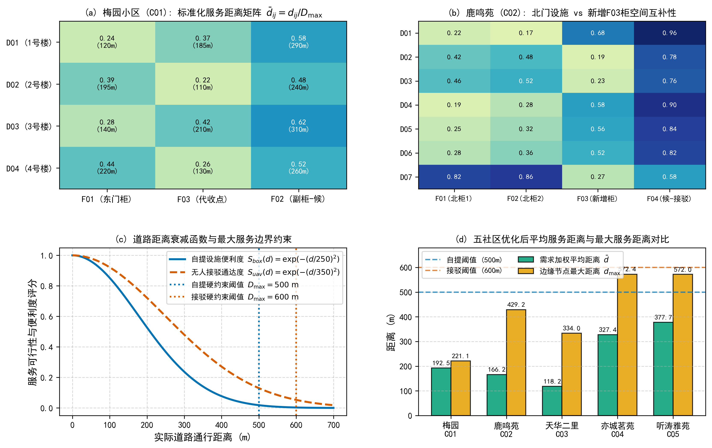
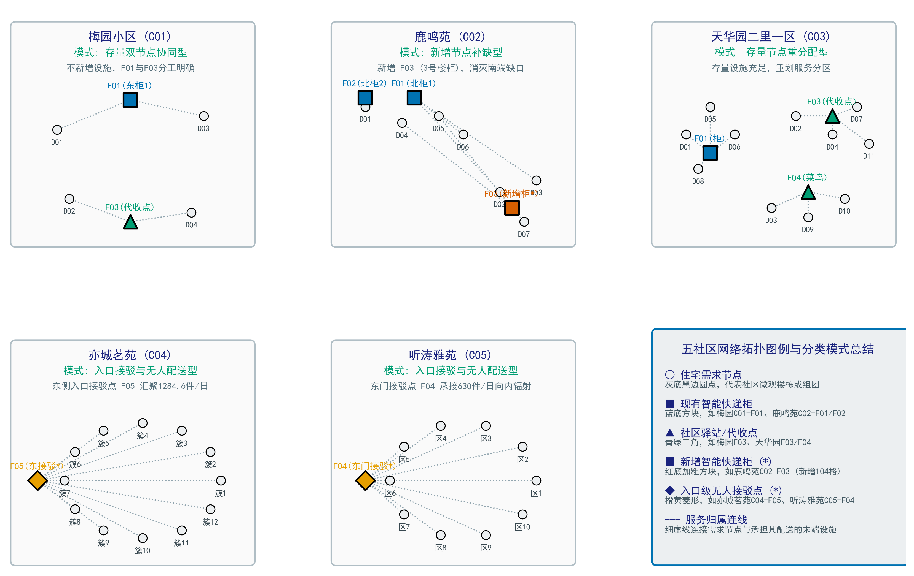
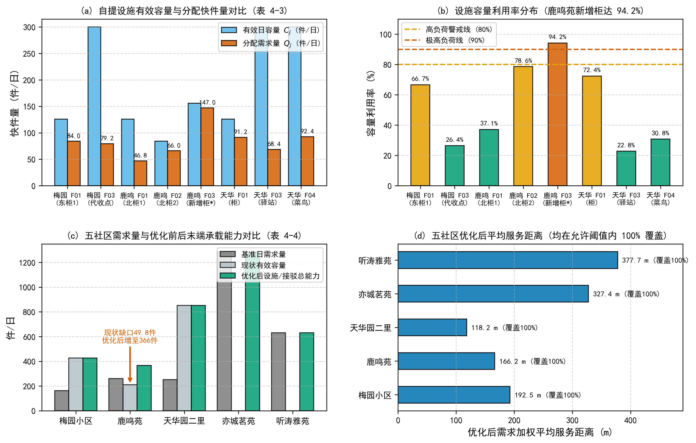
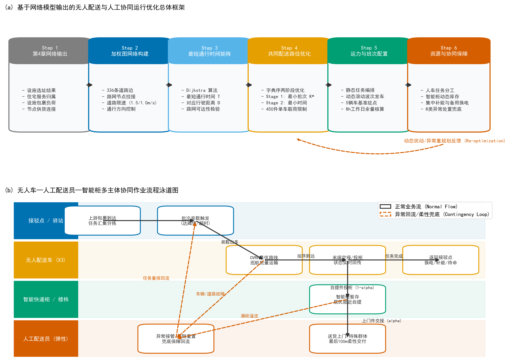
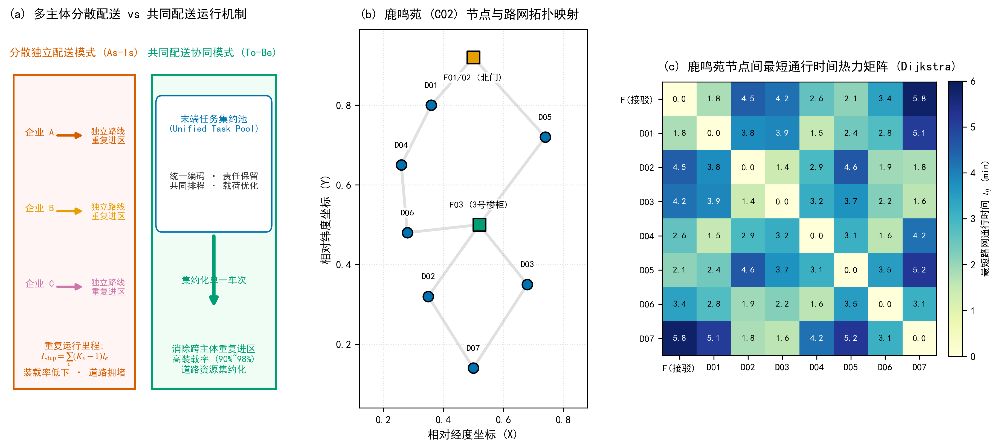
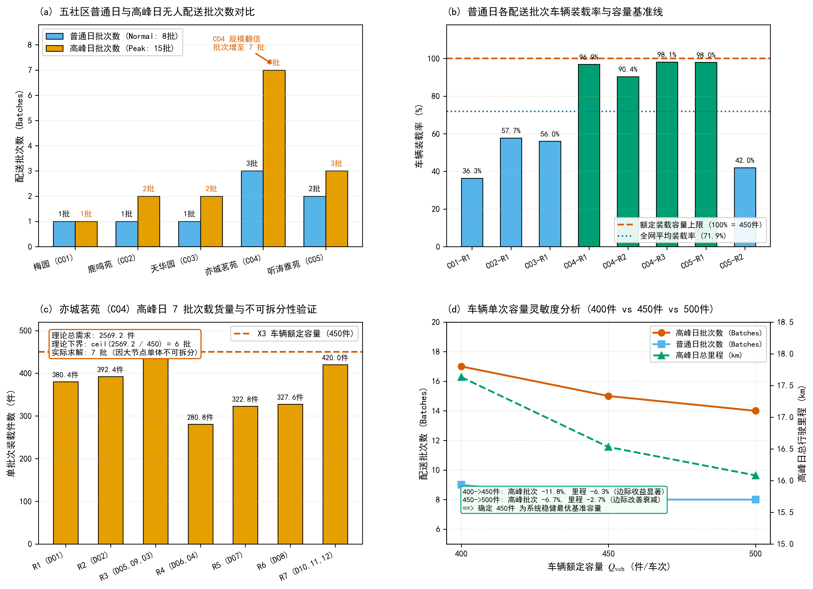
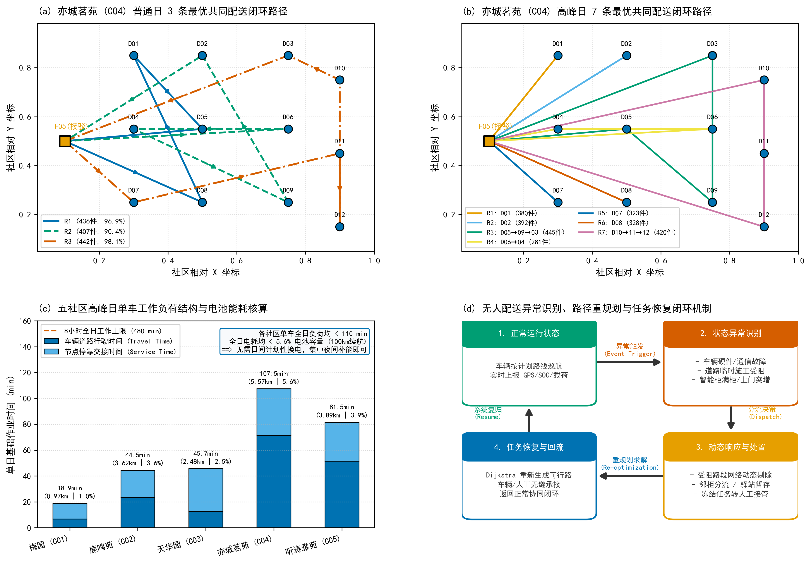

# 面向超大城市的末端配送协同网络数智化与绿色化决策平台

## 1. 项目简介

本项目面向超大城市末端配送中的空间约束、多主体分散配送、末端设施容量失衡与配送成本问题，使用北京经济技术开发区5个社区的样本空间数据，构建“需求预测、选址定容、人机协同路径优化、确定性情景推演与应急调度”一体化决策支持原型。当前运营参数中仍含C、D类假设，结论不表述为现场实测。

系统通过建立“物流分拨中心（HUB）— 社区接驳点 — 智能快件柜/楼栋单元”三级协同网络，实现了干线无人微卡集约巡回、末端无人车精准投柜补货与网格快递员上门履约的深度协同。

---

## 2. 成果展示与系统界面

### 2.1 现状诊断 (As-Is) vs 优化协同方案 (To-Be) 全景对比
系统提供现状纯人工粗放模式与数智化人机协同网络的同屏对比评价，全方位量化干线里程削减、末端工效提升、满柜风险清除与投资回收效益。



### 2.2 空间数字孪生底座与运筹求解控制台
系统接入亦庄示范区5个典型社区的WGS84样本边界、内部微循环路网与拓扑节点，并在前端展示规划公式、启发式求解过程及硬约束校验。正式比较中的距离暂采用WGS84直线距离乘绕行系数，属于D类估算，待真实OD矩阵补齐后复算。



### 2.3 学术级运筹模型验证与多维分析图集
项目严格对标全国大学生数学建模竞赛（国赛）高分论文与 SCI 顶级运筹学期刊标准，构建了涵盖物理时空约束机理、关键参数灵敏度阵列、多目标 Pareto 收敛演化及方案综合效益对抗的出版级科研图集：

#### 图 1 两阶段人机协同网络时空交接与物理约束原理示意
展示一级无人设备与二级网格配送员的时空交接强同步机制（ $ T_{rc}^k \ge A_{sr}^u + H_r^u $ ）、动力电池荷电状态（SOC）动态消耗与 20% 安全回航余量、以及两级载重沿途连续递减守恒过程。


#### 图 2 2E-MDVRPTW-DC 核心参数灵敏度分析阵列 (2x2)
系统分析超时恶性违约倍率（ $ c_2/c_1=3.5 $ 最优平衡拐点）、客户时间敏感系数（ $ \varepsilon $ 非线性效用衰减）、智能柜扩容比例（MIP 最优决策点 45% 彻底消除爆柜）及动力电池安全余量（20% 稳健最优阈值）。


#### 图 3 改进多目标进化算法（改进 NSGA-II）求解性能与 Pareto 前沿对比
对比改进 NSGA-II、经典 NSGA-II 与标准遗传算法 GA 的收敛特性（65代快速收敛，解质量提升17.0%）、双目标 Pareto 最优前沿与 TOPSIS 膝点折衷解（成本 131.4 万元，满意度 94.8 分）、超体积指标演化（HV=0.925）与计算复杂度扩展性。


#### 图 4 现状基准 (As-Is) vs 协同优化 (To-Be) 综合效益多维对比
全景量化六大核心运营指标降幅（干线里程-46.0%、社区步巡-34.2%、工时-59.8%、成本-53.6%、碳排-87.2%）、24小时社区快递柜时序负荷对抗（现状 156% 严重爆柜 vs 优化后 64.5% 安全线）、年运营成本结构重塑及六维效能全景雷达图。


### 2.4 多尺度社区配送需求概率估计与情景模拟模型 (第5章学术图集)
针对城市末端配送需求在社区宏观尺度、楼栋微观尺度与日内时序尺度的多维异质性，构建了基于贝叶斯层次 Gamma-Poisson / Dirichlet-Multinomial 的概率生成与情景推演体系：

#### 图 5-1 多尺度社区配送需求概率估计与情景模拟总体框架
构建“先验输入—贝叶斯层次生成—多尺度时空分解—蒙特卡洛分位数推演—运筹优化底座输出”完整五层数理架构。


#### 图 5-2 核心随机变量与贝叶斯层次概率生成机制
展示 $ \lambda_i \sim \mathrm{Gamma}(\alpha, \beta) $ 先验与共轭后验演变、日期情景乘数与日内波动项、泊松-Gamma 负二项超松弛分布以及 6 时段 Dirichlet-Multinomial 比例分布。


#### 图 5-3 五个案例社区日需求情景估计与分位数分布对比
全网 4316 户 5 大社区常态与大促 P50/P80/P90 负荷对比，揭示户数线性驱动机制（ $ R^2=0.999 $ ）与 1.75 倍大促稳定放大效应。


#### 图 5-4 五社区 6 时段分时需求演变与峰值负荷对比
展现 08:00—22:00 连续 6 时段到件波动，重点校核 17:00—20:00 晚高峰负荷集中度（亦城茗苑大促 P80 达 806 件/3小时，作为消灭爆柜的关键输入）。


#### 图 5-5 亦城茗苑多维核心参数灵敏度矩阵与响应分析
对亦城茗苑开展 $ 3 \times 3 $ 参数响应热力矩阵测试，测定需求率先验弹性 $ E_\mu = 1.01 $ 与大促乘数弹性 $ E_S = 1.04 $ ，验证模型平衡稳健性。


### 2.5 末端配送网络三阶段协同优化模型 (第4章学术图集)
针对超大城市典型社区存量设施能力不均、新建盲目与层级割裂问题，构建了“设施规模确定 — 节点选址与需求分配 — 节点连接优化”的三阶段协同选址模型：

#### 图 4-1 末端配送网络三阶段协同优化模型框架与平台调用逻辑
构建从覆盖规模确定到 P-中值选址分配，再到上下游供货网络优化与数字平台实时调用的闭环技术框架。



#### 图 4-2 五案例社区末端设施—需求节点服务可行关系与标准化距离热力矩阵
展示梅园、鹿鸣苑、天华园二里一区、亦城茗苑和听涛雅苑基于路网最短距离与服务半径限制的服务可行性与标准化距离热力矩阵。



#### 图 4-3 五案例社区优化后末端配送网络拓扑结构图
展示五大典型社区优化后的空间网络拓扑、设施服务范围划分、新建节点与入口级无人配送接驳枢纽。



#### 图 4-4 五社区末端设施容量—负荷对比及优化前后关键指标综合评价
全景对比各社区设施有效容量与实际货量负荷、现状基准 vs 优化后全网容量、加权平均服务距离及四类典型社区优化范式评估。



### 2.6 无人配送与人工协同运行优化模型 (第7章学术图集)
针对既定末端配送网络在车辆路径规划、运力与排班配置、多主体共同配送及人机协同异常兜底方面的运行决策需求，构建了“加权路网构建 — Dijkstra 最短通行时间 — CVRP 两阶段字典序优化 — 动态班次触发 — 资源与协同保障”的完整运行优化体系（详见 [第7章 无人配送与人工协同运行优化完整报告](docs/第7章_无人配送与人工协同运行优化.md)）：

#### 图 7-1 基于网络模型输出的协同运行优化总体框架与多主体协同作业流程泳道图
构建从路网加权图构建到 CVRP 字典序两阶段优化、运力排班与资源兜底的六步决策流程，结合接驳点/无人车/智能柜/配送员 4 主体泳道图与异常回流机制。



#### 图 7-2 多主体分散配送 vs 共同配送机制、鹿鸣苑节点路网映射及 Dijkstra 最短通行时间矩阵
对比多主体重复进区里程与共同配送集约化单一车次；展示鹿鸣苑接驳点、智能柜、住宅节点在 336 条道路边的精确空间映射；输出 Dijkstra 真实路网最短时间热力矩阵。



#### 图 7-3 五社区配送批次对比、装载率基准线、C04 高峰 7 批次载货量不可拆分性验证及车辆容量敏感性分析
全网普通日 8 批次增至高峰 15 批次；普通日大规模社区装载率达 $ 90\% \sim 98\% $ ；严格验证 C04 因 4 个特大需求节点不可拆分性强制 7 批次（非理论下界 6 批次）；敏感性分析证明单车 450 件为系统最佳基准容量。



#### 图 7-4 亦城茗苑普通日与高峰日路径空间对比、五社区工作负荷与电耗核算及异常恢复闭环机制
直观呈现 C04 普通日 3 条闭合环线向高峰日 7 条放射/环线拓扑演变；核算五社区单车工作量（最高 107.51 min 仅占 8h 工时的 $ 22.4\% $ ）与全日电耗（最大 $ 5.6\% $ 无需日间换电）；提出 8 类异常快速恢复闭环。



---

## 3. 核心运筹优化模型与数学表达

### 3.1 M1 干线巡回旅行商模型 (Trunk Tour TSP)
为消除现状各企业车辆从枢纽到社区独立点对点往返所造成的严重空驶率，构建以总干线运输里程最小化为目标的 TSP 巡回模型，并引入 MTZ（Miller-Tucker-Zemlin）约束消除子回路：


$$
\min Z_1 = \sum_{i \in V} \sum_{j \in V} c_{ij} x_{ij}
$$


$$
\text{s.t.} \quad \sum_{j \in V, j \ne i} x_{ij} = 1, \quad \forall i \in V
$$


$$
\sum_{i \in V, i \ne j} x_{ij} = 1, \quad \forall j \in V
$$


$$
u_i - u_j + |V| x_{ij} \le |V| - 1, \quad \forall i, j \in V \setminus \{\text{HUB}\}, i \ne j
$$


$$
x_{ij} \in \{0, 1\}, \quad u_i \in \mathbb{R}
$$


求解采用2-Opt局部搜索启发式算法。普通日统一评价结果为S0独立往返24.84 km、S1/S2巡回13.42 km，改善率46.0%；算法输出仅标记为可行启发式解，不声称全局最优。

### 3.2 末端配送网络三阶段协同选址与分配模型 (HFLAP)
详见专门技术文档：[第4章 末端配送网络模型建立](docs/第4章_末端配送网络模型建立.md)。

模型通过三阶段递进求解机制，解决超大城市复杂社区的设施规模、微观选址与上下游供货连接问题：
1. **第一阶段（规模确定）**：以新增设施最少为目标，在覆盖与容量约束下求出最低设施规模 $ P_{\text{cand}}^* $ ：


$$
\min Z_1 = \sum_{j \in J_{\text{cand}}} y_j, \quad \text{s.t.} \sum_{j \in J} x_{ij} = 1, \quad x_{ij} \le a_{ij} y_j, \quad \sum_{i \in I} w_i x_{ij} \le C_j y_j
$$


2. **第二阶段（选址分配）**：在规模锁定下求解带容量限制的 P-中值模型，实现需求加权路网距离最小化：


$$
\min Z_2 = \sum_{i \in I} \sum_{j \in J} w_i d_{ij} x_{ij}, \quad \text{s.t.} \sum_{j \in J_{\text{cand}}} y_j = P_{\text{cand}}^*
$$


3. **第三阶段（节点连接）**：根据货量周转优化上下游供货拓扑，形成完整端到端网络：


$$
\min Z_3 = \sum_{u \in U} \sum_{j \in J_{\text{locker}} \cup J_{\text{dock}}} W_j l_{uj} z_{uj}
$$


### 3.3 M5 贝叶斯层次概率需求估计与多尺度分解模型
详见专门技术文档：[第5章 多尺度社区配送需求概率估计与情景模拟模型](docs/第5章_多尺度社区配送需求概率估计与情景模拟模型.md)。

模型通过贝叶斯共轭更新机制，将社区入住户数 $ H_i $ 、户均需求率先验 $ \lambda_i \sim \mathrm{Gamma}(\alpha, \beta) $ 、日期情景乘数 $ S_t^s $ 与日内随机波动 $ \epsilon_{it} $ 结合：


$$
\Lambda_{it}^s = H_i \cdot \lambda_i \cdot \phi_{c(i)} \cdot S_t^s \cdot \epsilon_{it}
$$


$$
D_{it}^s \sim \mathrm{Poisson}(\Lambda_{it}^s) \implies D_i \sim \mathrm{NegBin}\left(r = \alpha, \; p = \frac{\beta}{\beta + H_i \phi S}\right)
$$


结合时段 Dirichlet-Multinomial 与服务方式二项 Logit 模型：


$$
[D_{it1}, \dots, D_{it6}] \sim \mathrm{Multinomial}(D_{it}^s, \; p_{it}), \quad p_{it} \sim \mathrm{Dirichlet}(\kappa \bar{p})
$$


$$
P(\text{door} \mid i) = \frac{\exp(V_{\text{door}, i})}{\exp(V_{\text{door}, i}) + \exp(V_{\text{locker}, i})}, \quad P(\text{locker} \mid i) = 1 - P(\text{door} \mid i)
$$


通过蒙特卡洛抽样（ $ R=10000 $ ）输出各社区常态日与促销日的 P50、P80、P90 经验分位数，直接作为 M6 选址定容、M2/M3 人机协同与 M8 动态推演的统一输入底座。

### 3.4 M6 容量受限选址定容混合整数规划模型 (Capacitated Facility Location & Sizing MIP)
针对传统单柜配置引发的高峰期严重满柜瓶颈，建立设施激活、副柜扩容与楼栋指派的多目标 MIP 模型：


$$
\min Z_6 = \sum_{j \in \mathcal{F}} (f_j y_j + c_s s_j) + \rho \sum_{i \in \mathcal{B}} \sum_{j \in \mathcal{F}} d_{ij} q_i x_{ij}
$$


$$
\text{s.t.} \quad \sum_{j \in \mathcal{F}} x_{ij} = 1, \quad \forall i \in \mathcal{B}
$$


$$
d_{ij} x_{ij} \le R_{\max} \; (150\,\text{m}), \quad \forall i \in \mathcal{B}, j \in \mathcal{F}
$$


$$
\sum_{i \in \mathcal{B}} q_i x_{ij} \le (C_{\text{main}} y_j + C_{\text{slave}} s_j) \cdot \theta_{\text{turnover}}, \quad \forall j \in \mathcal{F}
$$


$$
x_{ij} \le y_j, \quad s_j \le S_{\max} y_j, \quad \forall i, j
$$


$$
y_j \in \{0, 1\}, \quad s_j \in \mathbb{Z}_{\ge 0}, \quad x_{ij} \in \{0, 1\}
$$


模型按150 m覆盖约束和P20高峰情景动态峰值配置主柜与56格副柜。柜体占用率不在100%处截断，若容量、覆盖、工时或服务时间窗任一硬约束违反，方案状态即为`INFEASIBLE`。

### 3.5 M2 社区双层人机协同车辆路径模型 (Two-Echelon Collaborative CVRP)
界定无人配送车（X3 标称载重 200kg/容积 450L，等效运力 400 件）与人工快递员的分工界面：
- 无人车：承担出入口接驳点至各激活设施点、非上门楼栋入口的巡航投柜；
- 快递员：专注于老龄人群及特定大件楼栋的最后 100 米精准上门服务；
- 约束条件：包含单车次容量约束（400 件/次）与单网格快递员单日工时红线约束（480 分钟）。

### 3.6 M8 动态占用确定性情景推演
构建08:00至21:00按小时推进的状态转移模型：


$$
O_j(t + \Delta t) = \max\big(0, \; O_j(t) + A_j(t) - D_j(t)\big)
$$


其中 $ A_j(t)=Q_jw_t $ 使用冻结的分时到件权重， $ D_j(t)=O_j(t)p_t\gamma_s $ 使用冻结的取件释放率与情景系数。该实现没有采样随机到件或随机取件，因此正式名称是“确定性情景推演”，不是随机离散事件仿真。

---

## 4. 统一评价结果

以下均为`data/evaluation_results_v1.json`中的普通日N情景结果。三方案使用同一普通日需求2589.6件（五社区分别为163.2、259.8、252.0、1284.6、630.0件）。

| 评价指标 | S0 现状基准 | S1 网络与设施优化 | S2 人机协同 | S2相对S0 |
| :--- | ---: | ---: | ---: | ---: |
| 方案状态 | `INFEASIBLE` | `FEASIBLE` | `FEASIBLE` | 硬约束判定 |
| 干线运输总里程（km/日） | 24.84 | 13.42 | 13.42 | 改善46.0% |
| 人工社区内行走里程（km/日） | 5.39 | 9.05 | 5.29 | 改善1.9% |
| 人工总工时（人时/日） | 123.52 | 65.87 | 54.22 | 改善56.1% |
| 150m覆盖率 | 6.5% | 100.0% | 100.0% | 提升93.5个百分点 |
| 日终未完成件量（件） | 1465.1 | 0.0 | 0.0 | 改善100.0% |
| 年现金运营成本OPEX（万元/年） | 245.64 | 148.71 | 128.58 | 改善47.7% |
| 新增CAPEX（万元） | 0.00 | 7.18 | 44.98 | S2回收期0.38年 |
| 年运营碳排（kgCO2e/年） | 4479.1 | 6043.0 | 5252.9 | **变差17.3%** |
| 单件碳排（kgCO2e/件） | 0.0159 | 0.0093 | 0.0081 | 改善49.1% |

碳排结果并非“双降”：新增柜体运营用电使S2年运营总碳排高于S0。单件碳排下降的同时，总量碳排上升，两者必须同时报告。S0因覆盖与容量硬约束不满足，不得称为“可行最优基准”。

正式结果由`generate_evaluation_results.py`从`data/evaluation_input_v1.json`重建。结果文件包含S0/S1/S2在N、P15、P20、D-R、D-V、D-L六类情景下的18组结果，以及30个固定种子的稳定性统计。

---

## 5. 系统架构与技术栈

系统采用高性能前后端分离与轻量化微服务架构：

```
+-----------------------------------------------------------------------------------+
|                  前端展现层: WebGIS 数字孪生与运筹算法控制台                       |
|  - Vue 3 核心状态机 + Tailwind CSS 响应式科技主题                                 |
|  - Leaflet 1.9.4 + 高德暗黑矢量底图 (国内无障碍加载)                              |
|  - ECharts 5 专业图表库 (柜体占用时序图、五维效益雷达图、成本与运营碳排图)       |
|  - KaTeX 出版级数学公式实时渲染引擎                                               |
+-----------------------------------------------------------------------------------+
                                         │  ▲  HTTP RESTful API (JSON)
                                         ▼  │
+-----------------------------------------------------------------------------------+
|                  服务接口层: FastAPI 异步服务与网关中间件 (server.py)             |
|  - /api/overview: 全网拓扑、M1干线规划与全景对比核心指标矩阵                      |
|  - /api/calculate: 动态需求预测、MIP定容选址、M2人车协同路径多阶段连续求解        |
|  - /api/simulation: 08:00-21:00 动态占用确定性情景推演兼容接口                   |
|  - /api/evaluation: 单方案单情景统一评价结果                                      |
|  - /api/evaluation/matrix: 18组正式评价结果与审计元数据                           |
|  - /api/solver/models: 五大核心规划模型 LaTeX 规范表达字典                        |
|  - /api/amap/*: 高德开放平台 Web 服务接入与北京全域小区实时搜索规划               |
+-----------------------------------------------------------------------------------+
                                         │  ▲  内存数据流
                                         ▼  │
+-----------------------------------------------------------------------------------+
|                  算法核心层: 运筹优化与智能调度引擎 (demo/core/)                  |
|  - data_manager.py: 空间数据、路网边表与设施拓扑解析器                            |
|  - forecast_model.py: 多尺度需求分解与二项 Logit 离散选择模型                     |
|  - layout_optimizer.py: 容量受限选址定容混合整数规划 (MIP)                        |
|  - routing_engine.py: TSP 干线巡回与多主体协同 CVRP 引擎                          |
|  - evaluation_engine.py: S0/S1/S2统一评价、约束校验与结果追踪                     |
|  - simulation_engine.py: 统一结果的前端兼容适配器                                 |
|  - ai_copilot.py: 极端场景（大促暴单/极寒暴雪/车辆故障）自适应应急重排中枢        |
|  - amap_client.py: 高德开放平台地理编码、逆地理编码、周边搜与气象实况网关         |
+-----------------------------------------------------------------------------------+
```

---

## 6. 项目目录结构规范

```
.
├── .gitignore                      # Git 过滤规范（过滤私密文档与凭证）
├── README.md                       # 系统正式说明文档
├── requirements.txt                # Python 依赖清单
├── run_server.py                   # 根目录快速启动入口脚本
├── data/                           # 基础数据底座
│   ├── 五社区无人配送模型数据汇总.xlsx # 5社区WGS84边界、楼栋、设施与拓扑路网
│   ├── 01_社区空间数据包.xlsx       # 北京市社区单元与老旧小区分类数据
│   ├── 02_无人配送车与智能柜参数包.xlsx # 无人车技术参数、智能柜造价与电价碳排因子
│   └── 03_道路通行与政策规则包.xlsx # 北京市无人配送车道路测试与准入规则
├── docs/                           # 理论模型、运筹算法与出版级图集
│   ├── 第4章_末端配送网络模型建立.md # 第4章：末端配送网络三阶段协同选址与分配模型
│   ├── 第5章_多尺度社区配送需求概率估计与情景模拟模型.md # 第5章：需求概率估计与情景模拟
│   ├── 第6-7章_两阶段协同网络优化模型.md # 第6-7章：2E-MDVRPTW-DC 与协同求解
│   ├── two_stage_isa_algorithm_chapter7.md # 第7章：改进 NSGA-II 算法技术报告
│   ├── 基准与优化方案评价口径表.md # 统一评价口径与硬约束定义
│   └── images/                     # 出版级高分辨率 (300 DPI + 矢量 SVG) 图集
│       ├── network/                # 第4章网络拓扑与选址图集 (fig4_1 ~ fig4_4)
│       ├── demand/                 # 第5章需求预测与灵敏度图集 (fig5_1 ~ fig5_5)
│       ├── models/                 # 第6-7章运筹机理与 Pareto 前沿图集 (fig1 ~ fig4)
│       ├── comparison_telemetry.png# 现状与优化全景对比看板截图
│       └── platform_overview.png   # 平台数字孪生与算法控制台截图
└── demo/                           # 系统源码与资产
    ├── server.py                   # FastAPI 后端服务主程序
    ├── core/                       # 核心算法引擎包
    │   ├── __init__.py
    │   ├── data_manager.py         # 数据管理器
    │   ├── forecast_model.py       # 需求预测模型 (M5)
    │   ├── layout_optimizer.py     # 选址定容优化器 (M6)
    │   ├── routing_engine.py       # 协同路径规划引擎 (M1, M2)
    │   ├── evaluation_engine.py    # 唯一正式评价引擎与结果生成器
    │   ├── simulation_engine.py    # 统一评价结果兼容适配器
    │   ├── ai_copilot.py           # 智能调度与应急决策中枢
    │   └── amap_client.py          # 高德 Web 服务与 MCP 客户端
    └── static/                     # 前端单页应用
        ├── index.html              # 数字孪生大屏前端页面
        ├── app.js                  # Vue 3 核心状态与图表交互脚本
        ├── style.css               # 自定义科技主题与地图容器样式
        └── libs/                   # 本地化第三方前端核心库 (Leaflet, Vue, ECharts)
```

---

## 7. 环境准备与启动指南

### 7.1 环境依赖
- 推荐操作系统：Windows 10 / 11, Linux, macOS
- Python 版本：Python 3.10 及以上版本

### 7.2 安装步骤
克隆本仓库到本地环境：

```bash
git clone https://github.com/zhutmg00-eng/Logistics-Design-Competition.git
cd Logistics-Design-Competition
```

安装 Python 运行依赖：

```bash
pip install -r requirements.txt
```

### 7.3 启动系统
在项目根目录下执行启动脚本：

```bash
python run_server.py
```

终端将输出服务就绪提示：

```text
============================================================
超大城市末端配送协同网络数智化与绿色化决策平台
第九届北京市大学生物流设计大赛 · 主题二 原型系统
服务地址: http://127.0.0.1:8000
============================================================
```

在本地浏览器中访问 `http://127.0.0.1:8000` 即可使用系统全套功能。

---

## 8. 高德开放平台 Web 服务 Key 配置说明

系统默认基于亦庄示范区 5 大标杆社区的预置高精实证数据集运行。若需启用全北京任意真实小区的在线地理编码与实时拓扑扫描功能，可通过如下方式配置高德开放平台 Web 服务 Key：

1. 登录高德开放平台（lbs.amap.com），申请应用并获取 **Web 服务** 类型 API Key；
2. 在浏览器中打开系统，点击顶栏右上角 **“高德Key: 未绑定”** 按钮；
3. 在弹出的配置窗口中填入 Key 并点击 **“测试并保存生效”**，系统将自动发起连通性核验并持久化配置；
4. 进入 **“自定义推演”** 模块，输入北京任意小区名称（如“海淀远大园”、“望京新城”），系统将秒级调用高德接口完成空间要素提取与方案规划。

---

## 9. 团队协同开发与贡献指南

项目团队成员及各成员所使用的 AI 编程助手（如 Antigravity, Cursor, Copilot 等），请统一查阅并严格遵守 [项目远程协同与 Agent 规范指南 (COLLABORATING.md)](COLLABORATING.md)。该指南提供了零学习成本的 Agent 专属提示词、GitHub 贡献者头像身份绑定、Commit Message 规范及提交前隐私核验清单。
