# 前端使用与录屏教程

本文档面向参赛演示、答辩录屏和 PPT 截图，覆盖系统的完整业务链路：

> **M5 需求预测 → M6 选址定容 → M2/M3 人机协同路径 → M8 动态仿真 → 异常应急 → 自定义社区推演 → 学术模型验证**

---

## 1. 启动系统

在项目根目录 `D:\物流设计大赛` 打开 PowerShell：

```powershell
py -3.13 -m pip install -r requirements.txt
py -3.13 run_server.py
```

浏览器访问：

```text
http://127.0.0.1:8000
```

如果电脑没有 `py` 启动器，改用已安装 FastAPI 的 Python 3.10+：

```powershell
python3 run_server.py
```

> 不要直接双击 `index.html`。页面依赖 FastAPI 接口、Leaflet/ECharts 本地资源和后端算法计算。

---

## 2. 录屏前设置

### 2.1 推荐环境

- 浏览器：Microsoft Edge 或 Google Chrome。
- 分辨率：优先 `1920 × 1080`，PPT 可直接全屏使用。
- 页面缩放：`100%`。
- 关闭浏览器书签栏、下载提示、系统通知和其他无关标签页。
- 鼠标移动速度不要过快，单次点击后停顿 1–2 秒，便于后期剪辑。
- 如需展示移动端，将窗口宽度调整为 `390 px`，页面会自动切换到移动端单列布局。

### 2.2 推荐演示参数

| 场景 | 社区 | 方案 | 情景 | 特点 |
|---|---|---|---|---|
| 稳健成功案例 | C01 梅园小区 | S2 | N | 硬约束通过，适合开场和结论 |
| 复杂大社区案例 | C04 亦城茗苑 | S2 | N / P20 | 展示容量、步行距离、晚高峰压力 |
| 大促压力测试 | C04 亦城茗苑 | S2 | P20 | 展示 2.0 倍需求、满柜风险和仿真对抗 |

系统不会隐藏约束失败。顶部状态条会明确显示 `约束通过`、`待校验` 或 `约束告警`。录制时应主动解释：

- 绿色表示满足当前硬约束和计算条件；
- 黄色表示结果已生成但需要进一步确认；
- 红色表示存在容量、步行距离、工时或时序等约束未通过，不应直接称为可执行方案。

---

## 3. 页面结构

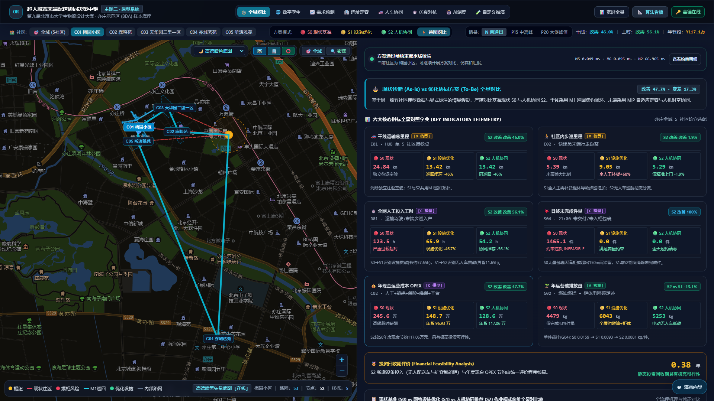

### 3.1 顶部模块导航

从左到右依次为：

1. **总览对比**：S0 现状、S1 设施优化、S2 人机协同的六维指标对比。
2. **数字孪生**：五社区真实边界、内部路网、HUB 和三级配送网络。
3. **需求预测**：M5 贝叶斯层次模型、P50/P80/P90 分位数和 6 时段曲线。
4. **选址定容**：M6 容量约束选址与扩容 MIP。
5. **人车协同**：M2/M3 无人车巡回、快递员上门、时空交接和电池余量。
6. **仿真对抗**：M8 多情景动态占用、满柜和工时压力。
7. **AI 调度**：暴单、暴雪、车辆故障三类应急事件。
8. **自定义推演**：任意社区户数、上门比例、派件强度的实时重算。
9. **算法看板**：M1、M2/M3、M2-ISA、M5、M6、M8 的公式、变量、约束和学术图谱。

### 3.2 全局控制条

- **社区**：切换全域或 C01–C05。
- **方案模式**：
  - `S0`：现状独立往返、现有设施、纯人工作业；
  - `S1`：M1 干线巡回和设施优化；
  - `S2`：设施优化 + 无人车 + 人工精准上门；
  - `叠图对比`：S0 与 S2 空间同屏比较。
- **情景**：
  - `N`：普通日 1.0 倍；
  - `P15`：中高峰 1.5 倍；
  - `P20`：大促峰值 2.0 倍。

### 3.3 约束状态条

每次重算后，状态条显示：

- 流水线状态：`FEASIBLE_HEURISTIC` 或 `INFEASIBLE`；
- 未通过的硬约束数量；
- M5、M6、M2 三段求解耗时；
- “查看约束明细”按钮。

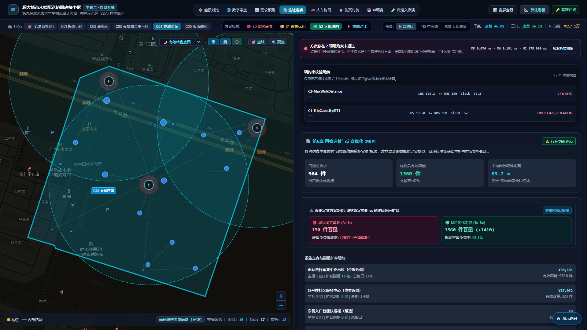

点击“查看约束明细”后，页面展示约束名称、左右值、Slack 和状态。讲解时应将约束和收益一起呈现，突出模型的严谨性。

### 3.4 内置演示向导

点击右下角 **演示向导**，系统会给出 8 个录屏步骤、建议时长、操作镜头和逐项结果说明。

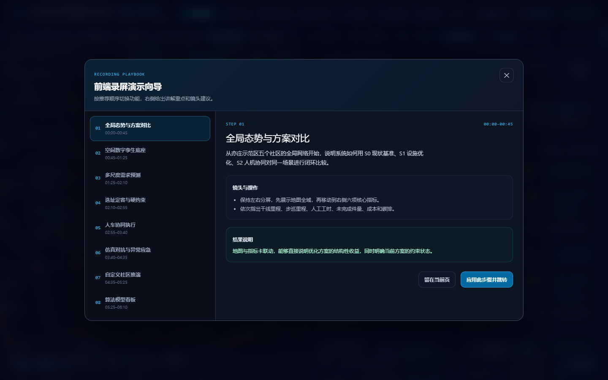

点击“应用此步骤并跳转”，页面会自动设置社区、方案和情景，并切换到对应功能模块。

---

## 4. 各模块操作

### 4.1 总览对比

1. 选择 `C01` 和 `S2`，情景选择 `N`。
2. 保持“左右分屏”，左侧查看空间网络，右侧查看六项指标。
3. 依次讲解：
   - 干线运输总里程；
   - 社区内步巡里程；
   - 全网人工投入工时；
   - 日终未完成件量；
   - 年现金运营成本；
   - 年运营碳排放量。
4. 点击“叠图对比”展示 S0 与 S2 的地图差异。

### 4.2 数字孪生

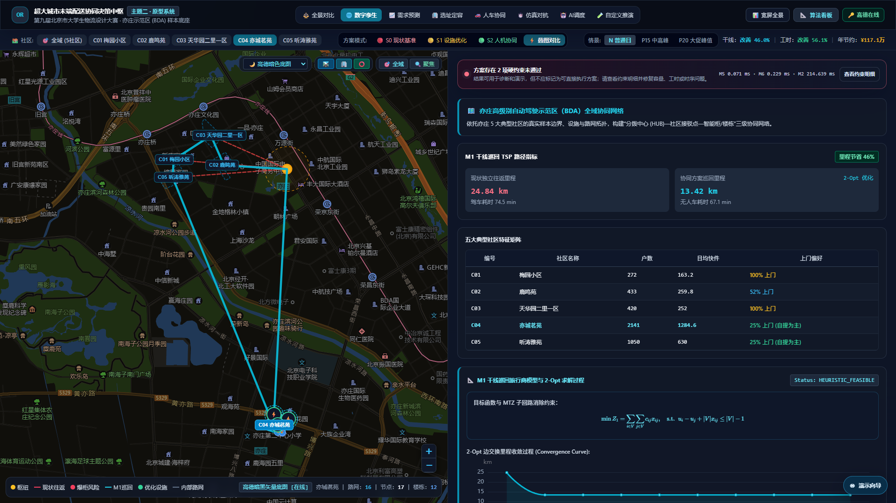

重点展示：

- HUB 到五个社区接驳点的 M1 巡回路径；
- 社区内部真实路网、楼栋节点和设施节点；
- M1 干线里程缩短比例；
- 五社区户数、日均件量和上门偏好。

地图右上角可以切换高德暗色、标准路网、卫星影像、OSM 和离线纯矢量 CAD 模式。

### 4.3 需求预测

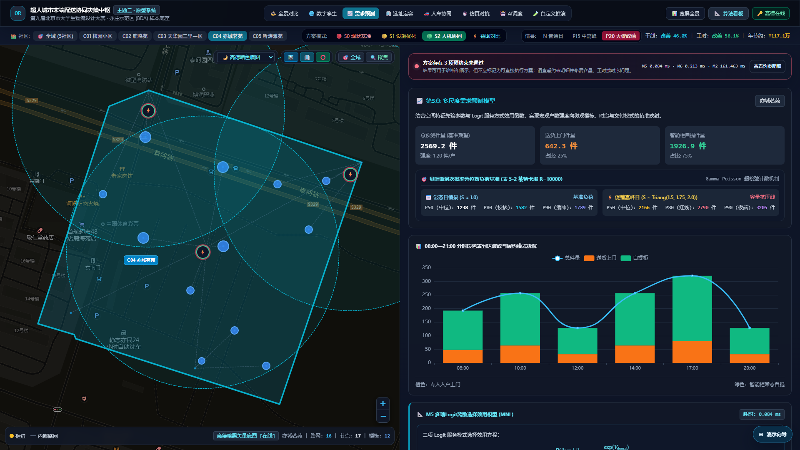

建议操作：

1. 选择 `C04`。
2. 在 `N 普通日` 和 `P20 大促峰值` 之间切换。
3. 讲解 P50、P80、P90 三层容量基准。
4. 指向 6 时段分时曲线，说明 17:00–20:00 的晚高峰。

该模块对应报告第 5 章，是后续 M6 设施容量和 M2/M3 运力安排的需求输入。

### 4.4 选址定容

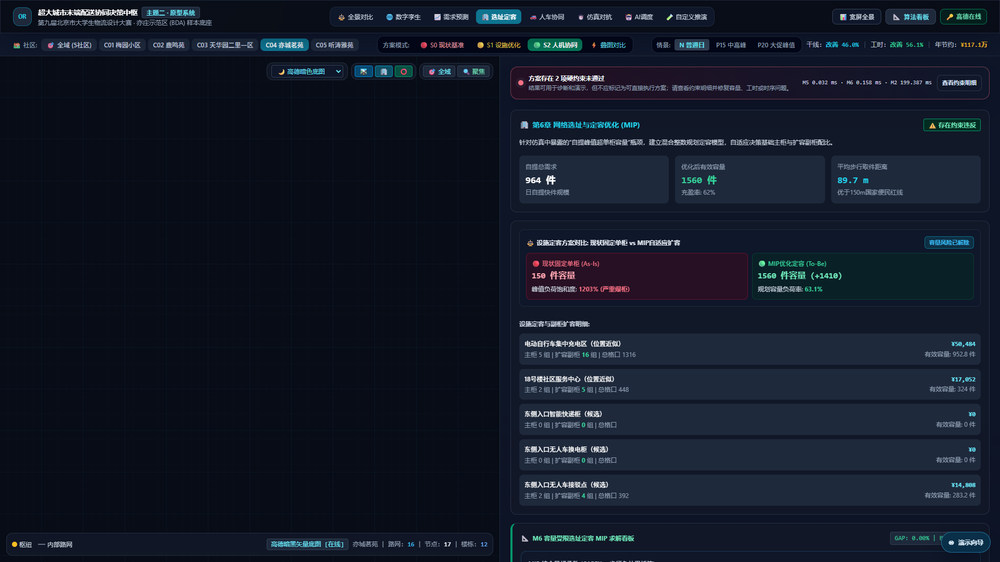

建议讲述顺序：

1. 原设施容量与优化后有效容量；
2. 新增柜组、扩容格口和建设成本；
3. 平均步行取件距离；
4. 是否有容量或 150 米便民红线约束未通过。

当约束未通过时，不要隐藏红色状态，可将其解释为“当前参数下的约束诊断结果”，并说明下一轮扩容或选址调整方向。

### 4.5 人车协同

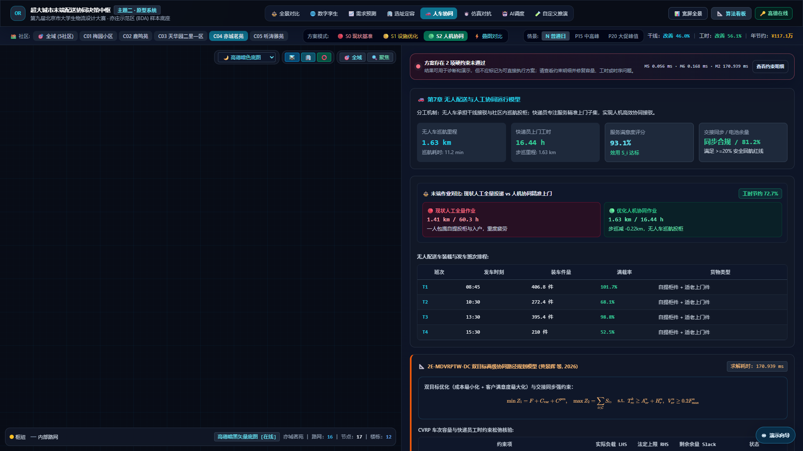

重点内容：

- 无人车社区巡航里程；
- 快递员上门工时；
- 服务满意度；
- 电池安全余量；
- 装车班次、载货量和容量利用率；
- 时空交接同步约束。

容量利用率超过 100% 时，系统会与全局约束状态联动。若为轻微容差，应在讲解中明确说明，不应将超载描述为零风险。

### 4.6 仿真对抗

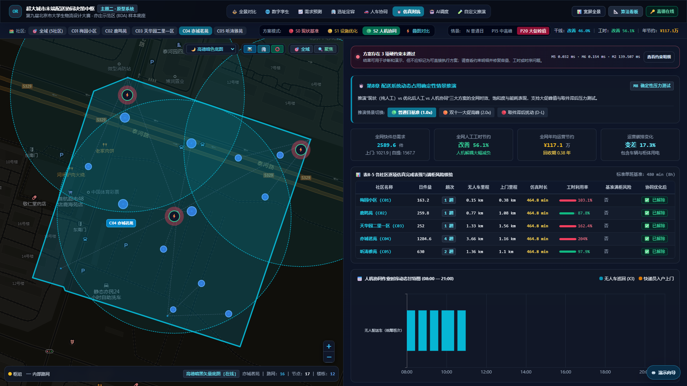

依次切换：

- 普通日基准；
- 双十一大促高峰；
- 取件滞后扰动。

讲解甘特图、柜体饱和度、各社区工时利用率和满柜风险。

### 4.7 AI 调度与异常应急

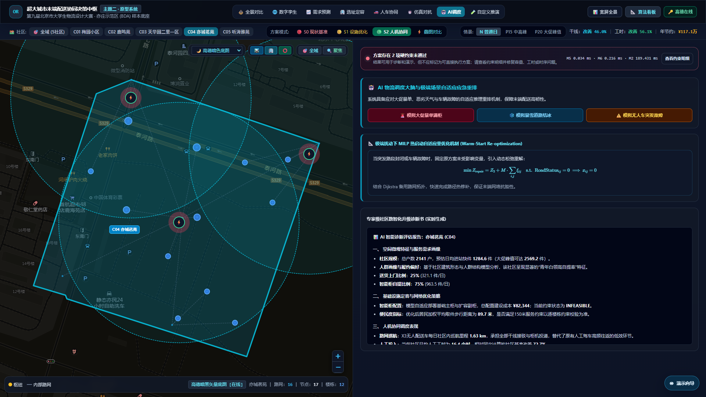

依次点击：

1. **模拟大促暴单满柜**；
2. **模拟暴雪道路结冰**；
3. **模拟无人车突发故障**。

每次事件后展示系统给出的自适应决策。最后向下滚动查看 AI 诊断报告。报告会将空间特征、设施配置、人机协同和约束状态组织成结构化文字。

> 若没有配置高德 Web 服务 Key，不影响系统主功能、仿真和模型看板；仅在线小区搜索不可用。

### 4.8 自定义社区推演

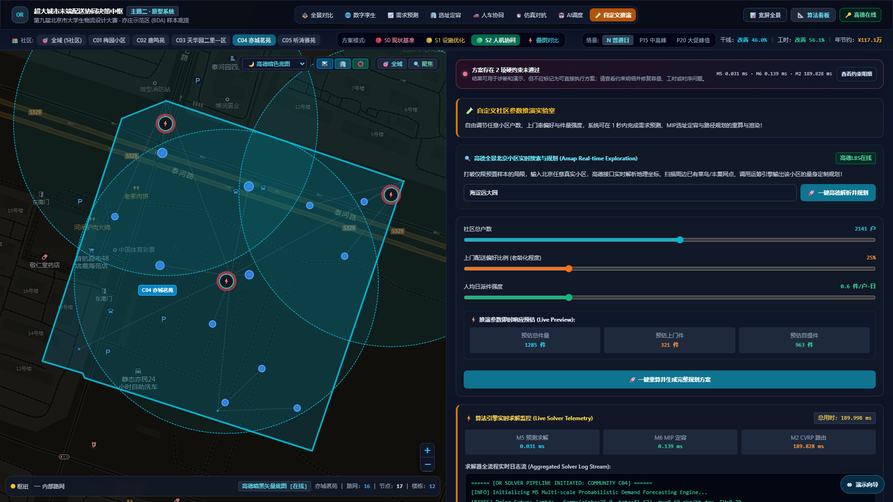

1. 选择社区。
2. 调整社区户数。
3. 调整上门配送偏好。
4. 调整人均日派件强度。
5. 观察实时预估值变化。
6. 松开滑块后再点击“一键重算并生成完整规划方案”。
7. 查看 M5、M6、M2 的求解耗时和真实日志。

滑块使用 `change` 事件触发重算，避免拖动过程中连续请求后端。系统同时会取消上一次未完成的计算请求。

### 4.9 算法看板

点击顶部“算法看板”，可查看：

- M1：干线多社区巡回 TSP；
- M2/M3：带时窗与时空交接的两级协同路径模型；
- M2-ISA：容量聚类与改进模拟退火；
- M5：多尺度需求预测与 Logit 离散选择；
- M6：容量受限选址定容 MIP；
- M8：动态占用确定性情景推演；
- 学术图谱：第 4、5、6、7 章出版级图谱。

M2-ISA 收敛曲线来自后端真实求解轨迹，不再使用前端随机数据。

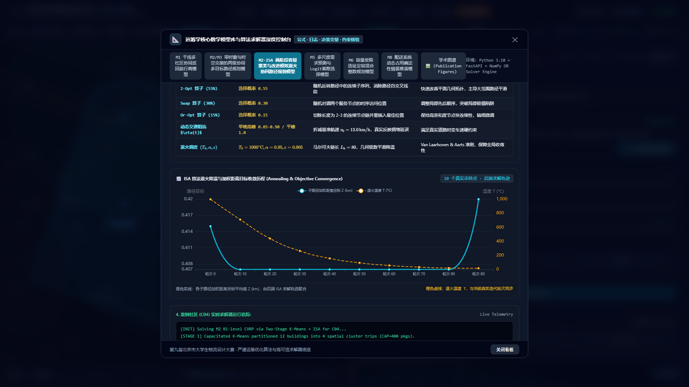

---

## 5. 推荐录制顺序

推荐采用“先可行性、后压力、再模型”的叙事顺序：

1. C01 总览，展示全局收益和硬约束通过。
2. C01 数字孪生，说明空间底座。
3. C04 需求预测，切换 P20 展示峰值。
4. C04 选址定容，展开约束明细。
5. C04 人车协同，展示人机分工。
6. C04 仿真对抗和异常应急。
7. C04 自定义推演，展示参数敏感性。
8. 算法看板，收束到项目第 4–8 章的模型体系。

---

## 6. 常见问题

### 页面显示“方案计算失败”

检查 FastAPI 服务是否仍在运行，并确认 `http://127.0.0.1:8000/api/overview` 可以访问。

### 地图底图为空

在图层下拉框中选择“离线纯矢量 CAD”。该模式不依赖外部瓦片服务，适合比赛现场网络不稳定时使用。

### 高德按钮显示未绑定

这是正常状态。只有需要执行“在线小区搜索与规划”时才必须填写高德 Web 服务 Key。

### 为什么 C04 显示红色约束告警

C04 是超大规模社区，现有参数下可能同时出现步行距离、班次容量或晚高峰工时压力。该状态用于展示模型的约束核验能力，不代表系统异常。

### 怎么让第一屏保持绿色

选择 `C01 梅园小区`、`S2 人机协同`、`N 普通日`。C01 在当前预置数据下通过硬约束校验。
