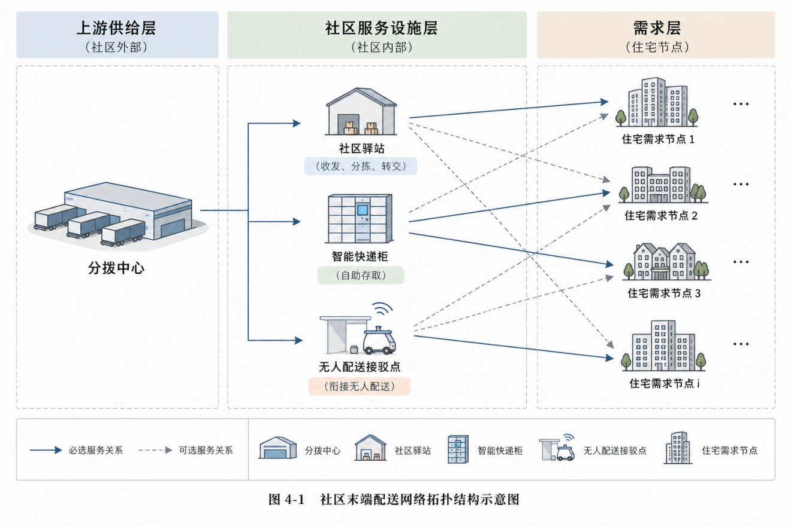
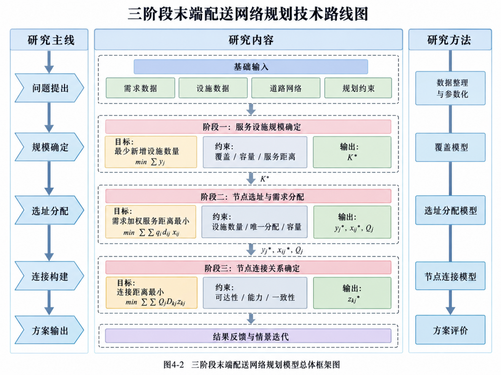
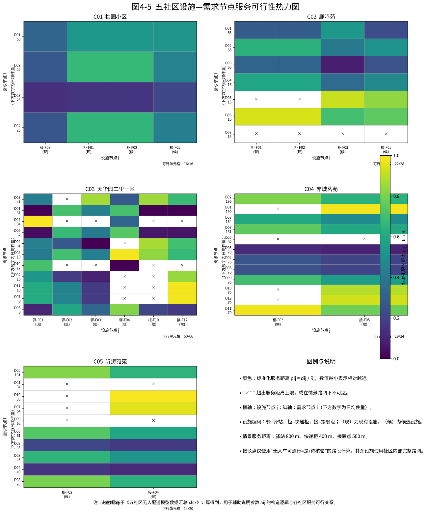
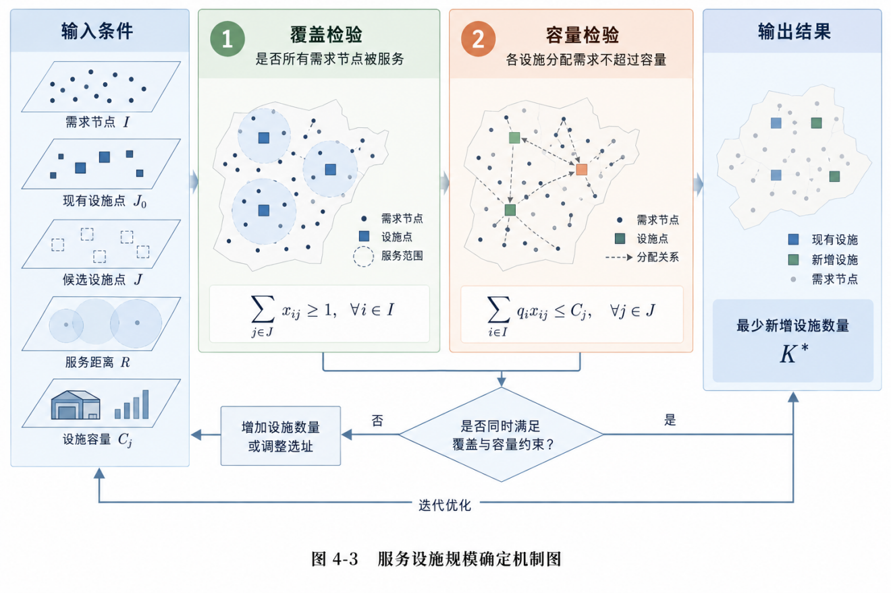
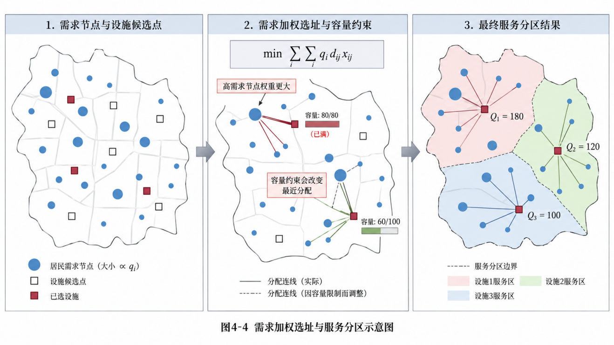

# 第4章 末端配送网络模型建立

## 4.1 问题提出与模型总体框架

### 4.1.1 问题描述
社区末端配送网络规划需要解决的并不只是某一个快递柜应当设置在哪里，而是需要同时考虑现有设施是否能够满足需求、是否需要增加新的服务节点、新增节点应设置在哪里、不同住宅需求由哪个节点承担，以及被选节点之间如何形成配送联系。当社区内部同时存在驿站、智能快递柜和无人配送接驳点时，单独优化某一种设施的位置，难以反映不同设施共同承担社区配送任务时的服务关系。

本方案将城市配送分拨中心视为社区外部的上游供给节点，将社区驿站、智能快递柜和无人配送接驳点作为社区内部的服务设施，将住宅楼或住宅建筑聚合区作为需求节点。其中：
- **社区驿站**：可以直接承接居民包裹，也可以承担部分包裹的集中接收和向末端设施的转交；
- **智能快递柜**：直接承担居民自提需求，具有固定的格口容量与周转限制；
- **无人配送接驳点**：作为无人车进入社区内部的衔接与换电/交接设施，其所覆盖的住宅需求将在后续无人配送与人工协同运行模型中进一步落实为具体车辆配送任务。

因此，本方案研究的基本网络层级关系可以表示为：
1. $\text{分拨中心} \to \text{社区驿站} \to \text{住宅需求节点}$
2. $\text{分拨中心} \to \text{社区驿站} \to \text{智能快递柜} \to \text{住宅需求节点}$
3. $\text{分拨中心} \to \text{智能快递柜} \to \text{住宅需求节点}$
4. $\text{分拨中心} \to \text{无人配送接驳点} \to \text{住宅需求节点}$
5. $\text{分拨中心} \to \text{社区驿站} \to \text{无人配送接驳点} \to \text{住宅需求节点}$

该网络结构并不要求所有包裹必须经过完全相同的节点：
- 对于面积较小、现有驿站已经能够覆盖主要需求的社区，可以由驿站直接服务住宅；
- 对于住宅分布较分散的社区，可以增加智能柜形成多个就近自提服务点；
- 对于内部道路具备无人配送通行条件的社区，则可以设置接驳点，将部分末端短驳任务交由无人配送设备完成。

换言之，网络层级是对设施功能关系的描述，而不是预先规定每个社区必须采用固定的设施组合。

目前五个案例社区（梅园小区、鹿鸣苑、天华园二里一区、亦城茗苑、听涛雅苑）已经形成完整的建模数据集，共有 4316 户模型需求户，划分为 45 个住宅需求节点，并整理出 17 个可由模型选择的候选设施和 336 条内部道路网络边。不同社区的需求节点数量、候选设施数量和道路网络规模存在明显差异，因此可以通过统一模型输入不同社区参数，分别求得适合各社区的最优设施组合。

从数学问题性质看，本方案属于**分级设施选址与分配问题**（Hierarchical Facility Location-Allocation Problem, HFLAP）。该类问题处理由不同类型设施组成的多层网络，需要同时确定设施的位置、容量约束、服务覆盖以及不同层级设施之间的供货连接关系。

### 4.1.2 建模思路与总体框架
末端设施选址面临三个层层递进的核心问题：
1. **应当配置多少个服务节点？**
   如果只要求服务距离尽可能短而不限制设施数量，模型增加越多节点通常越有利，最终可能把大量候选设施全部启用；反过来，若事先人为规定某个社区只能增加固定数量的节点，又缺乏科学的数据依据。因此，本方案不直接给定设施数量，而是先根据需求规模、设施容量和最大允许服务距离，求出满足基本服务要求所需的**最低设施规模**。
2. **相同设施数量下，应当选择哪些候选节点？**
   在设施规模确定后，不同候选点对住宅需求的覆盖效果不同：某些节点距离大量住宅较近，另一些节点虽然距离较远，但能够覆盖原有设施无法服务的边缘住宅。模型需要结合各住宅节点的需求量和实际道路距离，在候选设施之间进行组合选择，同时确定每个需求节点的主要服务设施。
3. **这些节点之间应怎样连接形成完整网络？**
   节点位置确定后，智能柜是由社区驿站补货还是直接接受上游分拨中心的包裹，无人配送接驳点由哪个上游节点供货，均需建立数学连接。只有确定这些联系，才能形成可供调度平台直接执行的端到端配送网络。

基于上述关系，本方案构建了三个连续计算环节的协同优化模型：
- **第一阶段（服务设施规模确定）**：采用集合覆盖与容量限制思想，在服务距离和设施容量约束下，以新增候选设施数量最少为目标，确定满足全域覆盖所需的最低设施规模 $P_{\text{cand}}^*$ ；
- **第二阶段（节点选址与需求分配）**：在设施数量固定的基础上，建立容量限制的 P-中值（Capacitated P-Median）选址分配模型，以需求加权实际道路服务距离最小为目标，确定具体启用的设施及其服务的住宅范围；
- **第三阶段（节点连接关系确定）**：根据已选设施的位置、实际承担包裹量和道路通行条件，以需求加权配送周转距离最小为目标，确定上游供货节点与各末端设施之间的连接关系。

三个阶段之间存在明确的数据传递逻辑，如图 4-1 所示：

---

## 4.2 模型假设、符号与服务可行关系

### 4.2.1 模型假设
为突出节点布局和服务分配的核心矛盾，同时保证模型能够充分利用案例数据进行严谨求解，作如下合理假设：
1. **需求量确定性假设**：在一次规划情景下，各需求节点的包裹需求量已知，由上一章需求预测模型（M5）提供。基准情景采用户均日派件率 0.6 件/户·日，高峰情景按峰值系数 2.0 放大。
2. **离散候选点假设**：设施选址属于离散选址问题，模型仅允许在现有设施和经过工程实勘筛选的候选位置中选择，不在社区内部任意生成未经论证的坐标。
3. **设施共用与共同配送假设**：不同快递企业的包裹进入社区后共享末端设施与无人接驳资源，汇总为社区统一住宅需求。
4. **唯一主要服务设施假设**：每个住宅需求节点在一个规划方案中由一个主要末端设施承担服务，明确服务界限，避免交叉冲突。
5. **有效处理容量假设**：所有服务设施均存在规划期内的有效日处理容量。社区驿站按日吞吐量计量；智能柜按格口数及日均格口周转率（基准取 1.5 次/日）换算有效日处理件数；无人接驳点按交接能力折算。
6. **实际路网可达性假设**：设施与需求节点之间的服务距离采用社区实际道路网络的最短路网距离 $d_{ij}$ 计算，严格反映出入口、围墙和建筑阻隔，而非经纬度直线距离；无人车接驳需额外满足专用路网通行条件。
7. **层级解耦假设**：本章网络模型主要确定设施位置、住宅分配与节点连接拓扑；无人车具体车次编排、发车间隔及人机协同路径由后续运行优化模型（第 6-7 章）求解。

### 4.2.2 符号与变量说明
模型所涉及的集合、参数、决策变量及中间量如表 4-1 所示：

**表 4-1 末端配送网络模型符号与变量说明**

| 符号 | 类型 | 含义 |
| :--- | :--- | :--- |
| $I$ | 集合 | 社区住宅需求节点集合，下标 $i \in I$ |
| $J$ | 集合 | 能够承担社区末端需求的服务设施全集，下标 $j \in J$ |
| $J_{\text{exist}}$ | 集合 | 已有并继续保留使用的服务设施集合，$J_{\text{exist}} \subset J$ |
| $J_{\text{cand}}$ | 集合 | 可由模型决定是否启用的候选设施集合，$J_{\text{cand}} \subset J$ |
| $J_{\text{station}}$ | 集合 | 社区驿站集合，$J_{\text{station}} \subset J$ |
| $J_{\text{locker}}$ | 集合 | 智能快递柜集合，$J_{\text{locker}} \subset J$ |
| $J_{\text{dock}}$ | 集合 | 无人配送接驳点集合，$J_{\text{dock}} \subset J$ |
| $U$ | 集合 | 可向上游末端设施供货的节点集合，包含分拨中心与已启用驿站，下标 $u \in U$ |
| $w_i$ | 参数 | 需求节点 $i$ 在规划期内的包裹需求量（件/日） |
| $d_{ij}$ | 参数 | 设施 $j$ 与需求节点 $i$ 之间的最短实际道路网络距离（m） |
| $l_{uj}$ | 参数 | 上游节点 $u$ 与末端设施 $j$ 之间的最短配送距离（m） |
| $C_j$ | 参数 | 设施 $j$ 在规划期内的有效处理容量（件/日） |
| $R_j^{\max}$ | 参数 | 设施 $j$ 对应的最大允许服务距离（m），驿站/智能柜基准 500 m，接驳点 600 m |
| $a_{ij}$ | 参数 | 设施 $j$ 是否能够有效服务需求节点 $i$，取值为 1 或 0 |
| $b_{uj}$ | 参数 | 上游节点 $u$ 与末端设施 $j$ 是否具备可通行的道路连接，取值为 1 或 0 |
| $y_j$ | 决策变量 | 0-1 变量，若设施 $j$ 被保留或启用取 1，否则取 0 |
| $x_{ij}$ | 决策变量 | 0-1 变量，若需求节点 $i$ 由设施 $j$ 主要服务取 1，否则取 0 |
| $z_{uj}$ | 决策变量 | 0-1 变量，若上游节点 $u$ 向末端设施 $j$ 供货取 1，否则取 0 |
| $P_{\text{cand}}^*$ | 中间量 | 第一阶段求解得到的满足全域覆盖所需的最少新增候选设施数量 |
| $W_j$ | 中间量 | 第二阶段求解后设施 $j$ 实际承担的包裹需求总量（件/日） |
| $\eta_j$ | 中间量 | 设施 $j$ 的容量利用率，$\eta_j = W_j / C_j \times 100\%$ |
| $Z_1$ | 目标值 | 第一阶段新增设施数量目标 |
| $Z_2$ | 目标值 | 第二阶段需求加权实际道路服务距离目标 |
| $Z_3$ | 目标值 | 第三阶段需求加权节点间连接配送距离目标 |

### 4.2.3 服务可行关系构建与可视化
设施在地理空间上接近某一住宅，并不意味着该设施必然能够承担其末端配送需求。社区围墙阻隔、出入口设置、单向通行及最大服务半径均会对实际可行性构成硬约束。

因此，本方案在求解选址前，首先基于实际路网距离与服务半径构建**服务可行参数** $a_{ij}$ ：

$$
a_{ij} = \begin{cases} 1, & d_{ij} \le R_j^{\max} \text{ 且二者之间存在满足通行条件的有效道路连接} \\ 0, & \text{其他} \end{cases}
$$

为消除不同类型设施最大服务半径差异（自提柜 500 m vs 无人接驳点 600 m）带来的视觉尺度不一致问题，定义**标准化服务距离** $\tilde{d}_{ij}$ ：

$$
\tilde{d}_{ij} = \frac{d_{ij}}{R_j^{\max}}
$$

当 $\tilde{d}_{ij} \le 1.0$ 时，表明需求节点处于设施允许服务范围内，数值越小代表服务距离越优越；当 $\tilde{d}_{ij} > 1.0$ 或道路不可达时，记为不可服务关系（在矩阵中以“ $\times$ ”标记）。

五个案例社区的服务可行关系与标准化距离热力矩阵如图 4-2 所示：

从图 4-2 的可行性热力分布可以得出：
1. **梅园小区（子图 a）**：现有设施（C01-F01 智能柜、C01-F03 物业代收点）对 4 个住宅节点的标准化距离均在 0.3~0.5 之间，覆盖裕度极大，说明存量设施完全具备全域覆盖条件。
2. **鹿鸣苑（子图 b）**：北门两组现有柜机（C02-F01、C02-F02）对北部组团较近，但对南部组团 D02、D03、D07 的标准化距离逼近 0.8~0.9；而候选设施 C02-F03（3号楼旁柜机）对南部住宅的标准化距离仅为 0.1~0.4，具有显著的空间互补性。
3. **天华园二里一区（子图 c）**：4 处现有设施分布较广，大部分住宅节点被 2~3 个设施重叠覆盖，具备充裕的重新划分服务边界空间。
4. **亦城茗苑与听涛雅苑（子图 d、e）**：两社区规模大、楼栋多，入口接驳候选点对全部住宅节点的标准化距离保持在 0.2~0.95 之间，在 600 m 无人车接驳半径下均具备全域连通可行性。

---

## 4.3 末端配送网络三阶段数学模型建立

### 4.3.1 第一阶段：服务设施规模确定模型
第一阶段的核心目标是确定在现有设施基础上，**最少需要新增多少个候选服务节点**才能满足整个社区的基本覆盖与容量需求。

**目标函数**：

$$
\min Z_1 = \sum_{j \in J_{\text{cand}}} y_j
$$

式中仅对候选设施集合 $J_{\text{cand}}$ 进行计数，已有设施不进入目标函数。

**约束条件**：
1. **需求完整分配约束**：每个住宅需求节点必须且只能由一个末端设施主要服务：

$$
\sum_{j \in J} x_{ij} = 1, \quad \forall i \in I
$$

2. **服务可行性与设施启用约束**：需求只能分配给已经启用且满足路网服务半径的设施：

$$
x_{ij} \le a_{ij} y_j, \quad \forall i \in I, \forall j \in J
$$

3. **设施有效容量约束**：分配给某设施的所有住宅日包裹需求总量不得超出其有效处理容量：

$$
\sum_{i \in I} w_i x_{ij} \le C_j y_j, \quad \forall j \in J
$$

4. **现有设施保留约束**：已建并继续使用的设施必须全部保留在网络中：

$$
y_j = 1, \quad \forall j \in J_{\text{exist}}
$$

5. **决策变量取值约束**：

$$
y_j \in \{0, 1\}, \quad \forall j \in J; \quad x_{ij} \in \{0, 1\}, \quad \forall i \in I, \forall j \in J
$$

求解上述模型可得最优新增设施规模：

$$
P_{\text{cand}}^* = Z_1^* = \sum_{j \in J_{\text{cand}}} y_j^*
$$

$P_{\text{cand}}^*$ 代表满足覆盖和容量约束所需的最低新增设施数量，该值将作为第二阶段模型的硬约束输入。

### 4.3.2 第二阶段：节点选址与需求分配模型
第二阶段在新增设施数量 $P_{\text{cand}}^*$ 已经固定的前提下，建立带容量限制的 P-中值选址与分配模型，确定**具体启用哪一组候选设施**以及**每个住宅需求节点归属哪一处设施**。

**目标函数**：最小化全社区住宅包裹需求加权的最短道路服务距离：

$$
\min Z_2 = \sum_{i \in I} \sum_{j \in J} w_i d_{ij} x_{ij}
$$

对应的全社区需求加权平均服务距离为：

$$
\bar{D} = \frac{\sum_{i \in I} \sum_{j \in J} w_i d_{ij} x_{ij}}{\sum_{i \in I} w_i}
$$

**约束条件**：
1. **设施规模固定约束**：新增候选设施数量严格等于第一阶段求解得到的最优规模 $P_{\text{cand}}^*$ ：

$$
\sum_{j \in J_{\text{cand}}} y_j = P_{\text{cand}}^*
$$

2. **服务完整性、可行性、容量及现有设施约束**：

$$
\sum_{j \in J} x_{ij} = 1, \quad \forall i \in I
$$

$$
x_{ij} \le a_{ij} y_j, \quad \forall i \in I, \forall j \in J
$$

$$
\sum_{i \in I} w_i x_{ij} \le C_j y_j, \quad \forall j \in J
$$

$$
y_j = 1, \quad \forall j \in J_{\text{exist}}
$$

$$
y_j \in \{0, 1\}, \quad \forall j \in J; \quad x_{ij} \in \{0, 1\}, \quad \forall i \in I, \forall j \in J
$$

求解第二阶段模型后，得到设施启用决策 $y_j^*$ 和需求归属决策 $x_{ij}^*$ 。据此计算每个设施实际承担的日处理需求量 $W_j$ 与容量利用率 $\eta_j$ ：

$$
W_j = \sum_{i \in I} w_i x_{ij}^*, \quad \forall j \in J
$$

$$
\eta_j = \frac{W_j}{C_j} \times 100\%, \quad \forall j \in J
$$

实际需求负荷 $W_j$ 将作为第三阶段计算设施间转运周转量的关键输入。

### 4.3.3 第三阶段：节点连接关系与供货路径确定模型
第三阶段在设施位置和住宅分配关系已固定的基础上，确定**包裹从上游分拨中心进入社区后在各级设施间的流动拓扑**。

设可以向末端设施供货的上游节点集合为 $U = \{\text{HUB}\} \cup J_{\text{station\_act}}$ ，其中 $\text{HUB}$ 为城市分拨中心， $J_{\text{station\_act}}$ 为第二阶段已启用的社区驿站集合。定义连接决策变量 $z_{uj} \in \{0, 1\}$ 表示上游节点 $u$ 是否向末端设施 $j$ 供货。

**目标函数**：最小化全网络需求加权的设施间配送转运距离：

$$
\min Z_3 = \sum_{u \in U} \sum_{j \in J_{\text{locker}} \cup J_{\text{dock}}} W_j l_{uj} z_{uj}
$$

式中 $l_{uj}$ 为上游节点 $u$ 至末端设施 $j$ 的实际通行距离， $W_j$ 为第二阶段确定的设施承担货量。

**约束条件**：
1. **单一上游供货约束**：每个启用的智能柜和无人接驳点必须且只能由一个上游节点供货；未启用的设施不能建立连接：

$$
\sum_{u \in U} z_{uj} = y_j, \quad \forall j \in J_{\text{locker}} \cup J_{\text{dock}}
$$

2. **供货驿站已启用约束**：若上游供货节点为社区驿站，该驿站自身必须已被启用：

$$
z_{uj} \le y_u, \quad \forall u \in J_{\text{station}}, \forall j \in J_{\text{locker}} \cup J_{\text{dock}}
$$

3. **道路通行与连接可行性约束**：设施之间只有在道路具备通行条件时方可建立供货联系：

$$
z_{uj} \le b_{uj}, \quad \forall u \in U, \forall j \in J_{\text{locker}} \cup J_{\text{dock}}
$$

4. **转运驿站综合吞吐容量约束**：当下游设施由社区驿站供货时，该驿站自身承担的直接服务量与转交下游设施的包裹总量之和不得超过其最大吞吐能力：

$$
W_u + \sum_{j \in J_{\text{locker}} \cup J_{\text{dock}}} W_j z_{uj} \le C_u, \quad \forall u \in J_{\text{station}}
$$

5. **决策变量取值约束**：

$$
z_{uj} \in \{0, 1\}, \quad \forall u \in U, \forall j \in J_{\text{locker}} \cup J_{\text{dock}}
$$

求解第三阶段模型后，三阶段成果 $y_j^*, x_{ij}^*, z_{uj}^*$ 组合构成完整的末端配送网络拓扑。

---

## 4.4 模型求解结果与五社区案例分析

### 4.4.1 五社区优化后末端配送网络拓扑结构
将五个案例社区的数据输入三阶段优化模型，求得的优化后网络结构如表 4-2 所示：

**表 4-2 五社区优化后末端配送网络结构与拓扑特征**

| 社区 | 基准日需求/件 | 节点调整结果 | 主要服务关系 | 优化后的网络拓扑特征 |
| :--- | :--- | :--- | :--- | :--- |
| **梅园小区** | 163.2 | 不新增设施，保留 C01-F01、C01-F03 | F01 服务 D01、D03；F03 服务 D02、D04 | 形成“智能柜 + 物业代收驿站”双节点协同就近服务网络 |
| **鹿鸣苑** | 259.8 | 保留 C02-F01、F02，**新增 C02-F03** | F01 服务 D04~D06；F02 服务 D01；**F03 服务 D02、D03、D07** | 由北门单极集中式升级为“北门综合设施 + 社区内部核心柜”多极网络 |
| **天华园二里一区** | 252.0 | 基准情景下不新增设施 | F01、F03、F04 承担主要住宅需求；F02 保留但暂不承担主要服务区 | 存量设施空间重分配，通过划定合理服务边界实现均衡负荷 |
| **亦城茗苑** | 1284.6 | **新增 C04-F05 东侧入口接驳点** | F05 作为社区入口级转运枢纽，承接 D01~D12 住宅组团末端转运 | 建立“外部分拨 → 社区入口接驳枢纽 → 内部无人车协同配装”网络 |
| **听涛雅苑** | 630.0 | **新增 C05-F04 东门接驳点** | F04 作为社区入口级转运枢纽，承接 D01~D10 住宅组团末端转运 | 建立“东门集中转运接驳 → 内部组团按时段送达”集约化配送网络 |

五个社区优化后的末端配送网络拓扑结构如图 4-3 所示：

从图 4-3 可以清晰观察到各社区的拓扑演变逻辑：
- **梅园小区（子图 a）**：呈现经典的双极自提服务模式，西侧与南侧住宅由东门智能柜与物业代收点精准划分，平均服务距离仅 192.5 m；
- **鹿鸣苑（子图 b）**：C02-F03（3号楼旁新增柜）的加入，使南部 3 栋高需求楼栋（D02、D03、D07）直接实现 100 m 以内就近自提，彻底打破原有全部集中于北门的长距离折返格局；
- **天华园二里一区（子图 c）**：三处活跃设施（F01 智能柜、F03 物业代收点、F04 菜鸟驿站）在社区内呈三角形均衡分布，服务半径均在 150 m 以内；
- **亦城茗苑与听涛雅苑（子图 d、e）**：通过在社区主要物流出入口部署无人配送接驳点，形成了集约化的“外部干线卡车 $\to$ 社区出入口接驳点 $\to$ 社区内部人机协同作业”的枢纽式配送网络。

### 4.4.2 设施配置、服务范围与容量负荷结果
依据模型第二阶段计算出的设施实际承担包裹量 $W_j$ 与容量利用率 $\eta_j$ ，整理五社区主要设施的配置与负荷结果如表 4-3 所示：

**表 4-3 五社区主要设施服务范围及容量配置结果**

| 社区 | 设施编码与名称 | 设施类型 | 主要服务需求节点 | 有效日容量/件 | 分配需求量/件 | 容量利用率 η_j |
| :--- | :--- | :--- | :--- | :--- | :--- | :--- |
| **梅园小区** | C01-F01 东门智能柜1 | 智能柜 (84格) | D01、D03 | 126.0 | 84.0 | 66.7% |
| **梅园小区** | C01-F03 物业代收点 | 社区驿站 | D02、D04 | 300.0 | 79.2 | 26.4% |
| **鹿鸣苑** | C02-F01 北门智能柜1 | 智能柜 (84格) | D04、D05、D06 | 126.0 | 46.8 | 37.1% |
| **鹿鸣苑** | C02-F02 北门智能柜2 | 智能柜 (56格) | D01 | 84.0 | 66.0 | 78.6% |
| **鹿鸣苑** | **C02-F03 3号楼旁新增柜** | **智能柜 (104格)** | **D02、D03、D07** | **156.0** | **147.0** | **94.2%** |
| **天华园二里一区** | C03-F01 现有末端智能柜 | 智能柜 (84格) | D01、D05、D06、D08 | 126.0 | 91.2 | 72.4% |
| **天华园二里一区** | C03-F02 现有备用节点 | 智能柜 (84格) | 基准情景暂无主服务区 | 126.0 | 0.0 | 0.0% |
| **天华园二里一区** | C03-F03 物业代收点 | 社区驿站 | D02、D04、D07、D11 | 300.0 | 68.4 | 22.8% |
| **天华园二里一区** | C03-F04 菜鸟驿站 | 社区驿站 | D03、D09、D10 | 300.0 | 92.4 | 30.8% |
| **亦城茗苑** | **C04-F05 东侧入口接驳点** | **无人配送接驳点** | **D01~D12** | **1500.0 (转运能力)** | **1284.6** | **85.6% (转运负荷)** |
| **听涛雅苑** | **C05-F04 东门接驳点** | **无人配送接驳点** | **D01~D10** | **800.0 (转运能力)** | **630.0** | **78.8% (转运负荷)** |

各设施的容量与负荷对比、全网服务距离及综合分类指标如图 4-4 所示：

从表 4-3 与图 4-4 可以看出：
1. **鹿鸣苑新增柜机 C02-F03 的高负荷关键性**：新增的 C02-F03 承担了 147.0 件/日，占全社区日总需求的 56.6%，容量利用率达到 94.2%。这充分证明模型选择在 3 号楼旁扩建柜机，并非盲目追求网点数量，而是准确命中了原有设施在南部高密度区域的严重容量缺口与服务盲区。
2. **天华园二里一区存量设施的优化重组**：C03-F01 智能柜利用率达到 72.4%，两处驿站利用率在 22%~31% 之间，整体负荷健康且保有充足的高峰弹性；而 C03-F02 在基准日量下未承担主要服务区，可作为大促促销期间的备用扩容冗余。
3. **加权服务距离大幅缩短**：优化后梅园、鹿鸣苑、天华园二里一区的居民平均取件距离分别仅为 192.5 m、166.2 m 和 118.2 m，远优于行业通常的 500 m 步行舒适阈值；亦城茗苑（327.4 m）和听涛雅苑（377.7 m）在接驳点 600 m 覆盖半径下亦实现了全域 100% 连通。

### 4.4.3 现状基准 vs 优化方案综合效果分析
将五个案例社区的现状设施基础与模型优化结果进行全面对照，如表 4-4 所示：

**表 4-4 五社区现有设施基础与优化结果综合比较**

| 社区 | 基准日需求/件 | 现状空间覆盖率 | 现状有效容量 vs 需求 | 现状是否满足约束 | 新增服务节点 | 优化后覆盖率 | 优化后平均服务距离/m |
| :--- | :--- | :--- | :--- | :--- | :--- | :--- | :--- |
| **梅园小区** | 163.2 | 100.0% | 426 件 > 163.2 件 | **满足** | 0 | 100.0% | 192.5 |
| **鹿鸣苑** | 259.8 | 约 94.2% | 210 件 < 259.8 件 | **不满足 (缺口 49.8 件)** | **1 (C02-F03)** | 100.0% | 166.2 |
| **天华园二里一区** | 252.0 | 100.0% | 852 件 > 252.0 件 | **满足** | 0 | 100.0% | 118.2 |
| **亦城茗苑** | 1284.6 | 缺少常设物流节点 | 无常设数据 | **不满足 (无固定枢纽)** | **1 (入口接驳点)** | 100.0%* | 327.4 |
| **听涛雅苑** | 630.0 | 缺少常设物流节点 | 无常设数据 | **不满足 (无固定枢纽)** | **1 (入口接驳点)** | 100.0%* | 377.7 |

*注：亦城茗苑与听涛雅苑的“100.0%”表示在 600 m 接驳服务情景下全部住宅节点均在接驳点路网覆盖范围内。*

通过综合对比，可将超大城市典型社区的末端物流优化归纳为**四种典型范式**：
1. **现有设施基本适配型（梅园小区）**：存量设施空间覆盖全面、容量充裕，优化重点在于消除冗余盲目建设，通过规范“楼栋—设施”归属关系实现双节点高效协同。
2. **新增节点补缺型（鹿鸣苑）**：存量设施存在空间单极偏置和总容量赤字（现状容量仅能满足 80.8% 需求），必须通过在核心负荷重心精准增设智能柜（C02-F03），实现“补足容量缺口”与“缩短步行半径”的双重收益。
3. **存量节点重分配型（天华园二里一区）**：存量设施资源极为丰富，优化核心在于打破原有无序自提格局，依据路网距离重构服务边界，平衡设施负荷，预留弹性备用节点。
4. **入口接驳网络构建型（亦城茗苑、听涛雅苑）**：针对超大型、封闭式高层社区，由于内部设施数据缺失且直接入户成本高昂，建立入口级无人配送接驳点是打通末端集约化配送的最优破局解。

### 4.4.4 包裹节点组合生成与数字平台调用
前述三阶段模型不仅解决了长期的设施规划选址问题，更将优化结果转化为数字决策平台能够实时调用的路由数据结构。

平台在实际调度运行时，无需针对每一个订单重新运行耗时的整数规划求解器，而是依据离线求得的矩阵直接进行链式匹配，调用逻辑如表 4-5 所示：

**表 4-5 包裹节点组合生成与平台调用逻辑**

| 步骤 | 平台输入或读取内容 | 调用模型结果 | 实时输出内容 |
| :---: | :--- | :--- | :--- |
| **Step 1** | 包裹目的地址、社区 ID | 五社区网络拓扑配置库 | 锁定所属社区子网络 |
| **Step 2** | 楼栋或住宅单元信息 | 需求节点空间拓扑 I | 快速映射匹配住宅需求节点 i |
| **Step 3** | 需求节点 i | 查询第二阶段分配矩阵 x_ij^* | 确定该包裹的主要末端服务设施 j |
| **Step 4** | 末端服务设施 j | 查询第三阶段连接矩阵 z_uj^* | 确定该设施对应的上游社区转运/分拨节点 u |
| **Step 5** | 用户输入的上游分拨节点 | 拼接设施间层级路由链条 | 形成完整节点组合链： HUB → u → j → i |
| **Step 6** | 节点组合及分时需求量 | 输入第 6-7 章人机协同运行模型 | 求解并输出无人车/快递员详细执行班次与路径 |

以基准情景为例，平台生成的典型包裹节点组合链如表 4-6 所示：

**表 4-6 基于五社区优化网络的典型包裹节点组合示例**

| 业务场景 | 最终需求节点 | 模型匹配末端设施 | 平台输出的标准节点组合路径 |
| :--- | :--- | :--- | :--- |
| **梅园 1 号楼包裹** | C01-D01 | C01-F01 东门智能柜1 | 城市分拨中心 → 社区入口 → C01-F01 智能柜 → 居民自提 (C01-D01) |
| **梅园 2 号楼包裹** | C01-D02 | C01-F03 物业代收点 | 城市分拨中心 → 社区入口 → C01-F03 驿站 → 居民自提 (C01-D02) |
| **鹿鸣苑南部住宅包裹** | C02-D07 | C02-F03 新增智能柜 | 城市分拨中心 → 社区入口 → **C02-F03 3号楼新增柜** → 居民自提 (C02-D07) |
| **亦城茗苑高层组团包裹** | C04-D05 | C04-F05 东侧接驳点 | 城市分拨中心 → **C04-F05 东侧接驳点** → 无人车驳运 → C04-D05 |
| **听涛雅苑中央组团包裹** | C05-D09 | C05-F04 东门接驳点 | 城市分拨中心 → **C05-F04 东门接驳点** → 无人车驳运 → C05-D09 |

通过该数据结构，平台实现了“**规划模型指导调度、实时调度反馈负荷**”的数智化闭环，为后续无人车路径规划与人工协同配送提供了坚实的网络拓扑支撑。

---

## 4.5 本章小结
本章立足于超大城市复杂社区的末端配送实际痛点，在上一章需求预测模型输出的基础上，建立了“**服务设施规模确定 — 节点选址与需求分配 — 节点连接关系优化**”的三阶段协同优化模型，并结合北京经开区五个典型案例社区进行了全景求解与实证分析：

1. **构建了严谨的三阶段递进数学模型**：
   - 第一阶段以新增设施最少为目标，在覆盖与容量约束下求出最低设施规模 $P_{\text{cand}}^*$ ；
   - 第二阶段在规模锁定下建立带容量限制的 P-中值模型，实现需求加权实际路网距离最小化；
   - 第三阶段根据实际货量周转优化上下游供货连接拓扑，形成完整可落地的末端配送网络。
2. **揭示了五社区差异化的优化范式**：
   - 梅园小区（现有设施适配型）与天华园二里一区（存量重分配型）无需盲目新增设施，通过优化需求服务边界即可实现高效均衡运行；
   - 鹿鸣苑（新增补缺型）通过在 3 号楼精准增设 104 格智能柜，以 94.2% 的高利用率完美弥补了南部 56.6% 的需求缺口，使全社区平均取件距离压缩至 166.2 m；
   - 亦城茗苑与听涛雅苑（入口接驳型）通过建立出入口无人配送接驳点，为超大封闭社区探索出“外部干线集约直达 + 内部无人车接力配送”的新型物流模式。
3. **实现了规划成果向平台调度的无缝衔接**：
   - 将三阶段优化决策固化为标准化的链式路由查询逻辑，使数字决策平台具备秒级响应海量订单节点组合生成的能力，为后续第 6-7 章两阶段人车协同路径优化模型奠定了核心网络基础。