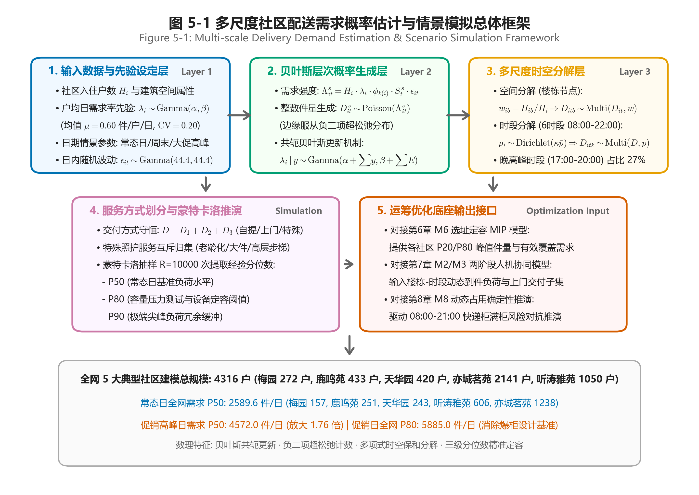
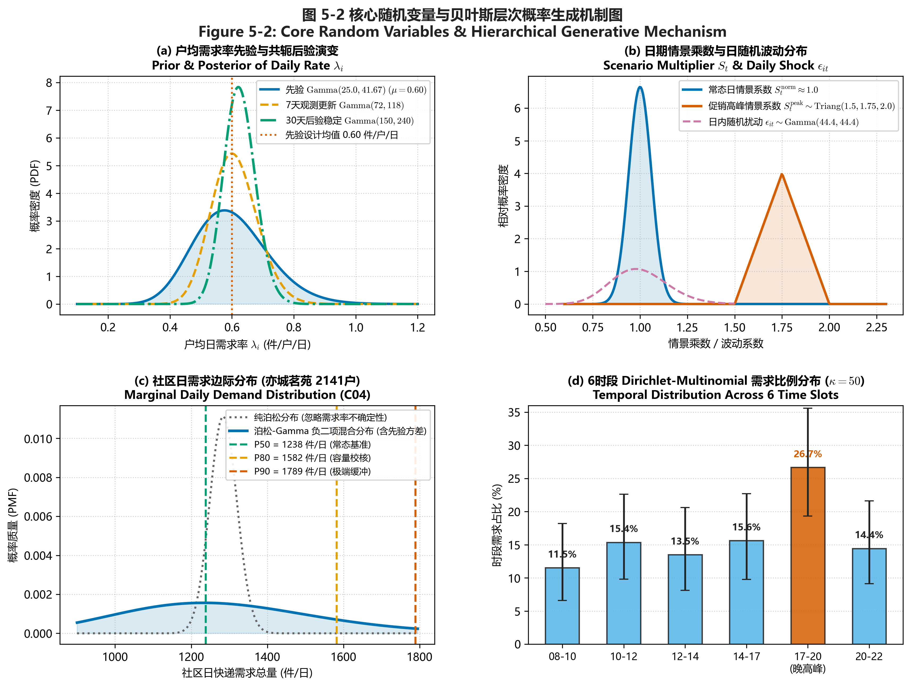
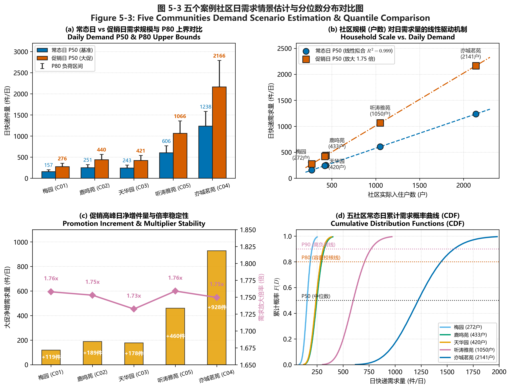
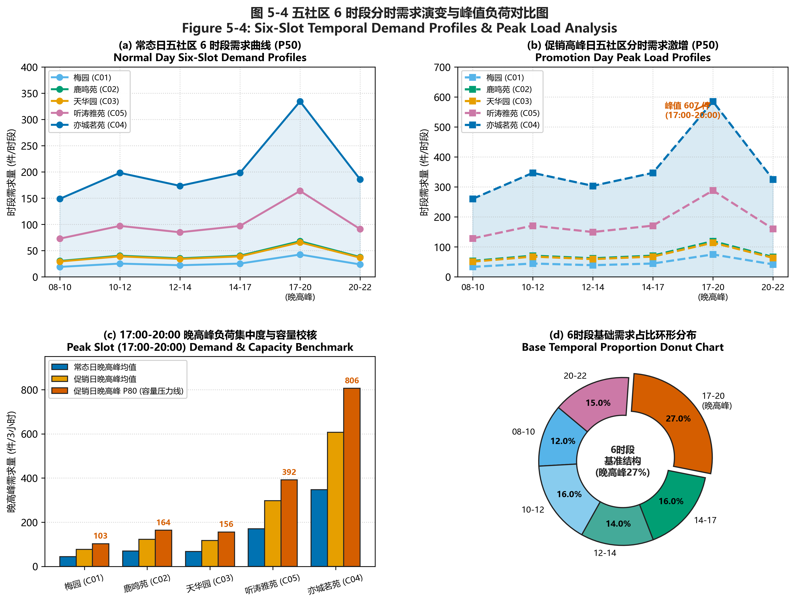
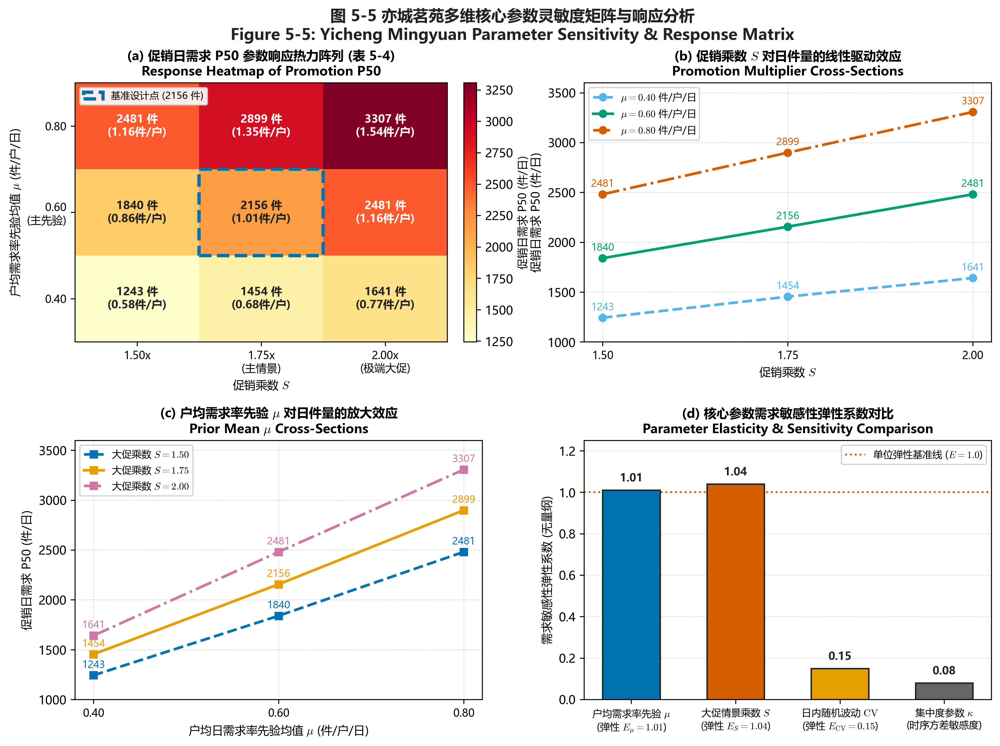

# 第5章 多尺度社区配送需求概率估计与情景模拟模型

## 5.1 问题提出与模型总体框架

### 5.1.1 社区末端配送需求识别问题
社区是快递末端配送的基本服务单元，但可直接用于模型估计的社区级日件量观测仍较有限。现有行业统计多反映城市或区域层面的业务总量，难以直接识别单个社区的日配送需求，更无法刻画需求在楼栋与时段之间的分布。在缺乏细粒度业务记录的情况下，依据人口或户数进行统一折算虽可获得需求量级的初步估计，却可能将规模相近而空间结构、居住形态和服务条件不同的社区视为同质服务单元。

社区间差异不仅体现于包裹总量，还表现为需求的空间集聚程度与服务方式构成：
- **大型高层社区**（如亦城茗苑 2141 户）：需求高度集中于少数高层楼栋及核心交付节点，高峰承载压力巨大；
- **低层步梯社区**（如梅园 272 户）：即使总需求较低，老龄人口与步梯结构也产生相对更高的上门或辅助交付需求；
- **混合住宅社区**（如天华园二里一区 420 户、听涛雅苑 1050 户）：同时存在集中与分散的需求区域。

若仅依据社区日均件量配置驿站容量和无人配送设备，容易低估高峰时段的承载压力及社区内部的服务异质性。因此，需求识别应由单一总量估计扩展为对**日期情景**、**日内时段**、**空间节点**和**服务方式**的多尺度刻画。

### 5.1.2 模型研究目标
本章旨在构建适用于不同数据可得性条件的社区末端配送需求概率估计与情景模拟方法：
1. 以实际入住户数 $H_i$ 和户均日需求率 $\lambda_i$ 为基础估计社区日需求分布；
2. 通过常态日、周末和促销高峰日等情景系数刻画不同负荷水平；
3. 将日总量分解至楼栋或住宅组团及日内时段；
4. 结合调查与社区服务条件划分自提、普通上门和特殊服务需求。

模型输出不仅包括社区日需求规模，还包括不同情景下的需求分位数（P50、P80、P90）、分时需求与空间分布，分别为快递柜/驿站常态容量配置（第6章 M6）、高峰承载能力校核（第8章 M8）以及后续无人配送运力配置（第7章 M2/M3）提供量化输入。

### 5.1.3 模型总体框架
模型遵循“**需求概率估计 — 情景模拟 — 多尺度分解 — 优化输入**”的总体逻辑，如图 5-1 所示：

城市社区类型层与案例社区层采用统一的估计与情景模拟机制：最终形成“社区 — 情景 — 楼栋 — 时段 — 服务方式”多维需求矩阵，并以第 50、第 80 和第 90 百分位数（P50、P80、P90）表征不同负荷水平下的容量需求。

---

## 5.2 模型变量与参数设定

### 5.2.1 模型变量及符号说明

| 符号 | 含义 | 单位或取值 |
| :--- | :--- | :--- |
| $i$ | 社区索引 | $i \in \{1, 2, \dots, I\}$ |
| $c$ | 社区类型索引 | 低层步梯、普通高层、大型高密度、混合型 |
| $b$ | 楼栋或住宅节点索引 | $b \in \{1, 2, \dots, B_i\}$ |
| $t$ | 日期索引 | $t \in \{1, 2, \dots, T\}$ |
| $s$ | 日期情景索引 | 常态日 (norm)、周末 (wknd)、促销高峰日 (peak) |
| $k$ | 日内时段索引 | 6 时段：08-10, 10-12, 12-14, 14-17, 17-20, 20-22 |
| $m$ | 服务方式索引 | 普通自提 ($m=1$)、普通上门 ($m=2$)、特殊服务 ($m=3$) |
| $q$ | 需求分位水平 | $q \in \{0.50, 0.80, 0.90\}$ (P50, P80, P90) |
| $H_i$ | 社区 $i$ 的实际入住户数 | 户 |
| $P_i$ | 社区 $i$ 的常住人口 | 人 |
| $O_i$ | 社区 $i$ 的老年人口比例 | 比例 (0~1) |
| $H_{ib}$ | 社区 $i$ 中楼栋 $b$ 的入住户数 | 户 |
| $y_{it}$ | 社区 $i$ 在日期 $t$ 的实际观测件量 | 件/日 |
| $\mu$ | 户均日需求率的先验均值 | 0.60 件/户/日 |
| $\lambda_i$ | 社区 $i$ 的户均日快递需求率 | 件/户/日 |
| $\alpha, \beta$ | 户均日需求率 Gamma 先验的形状与速率参数 | $\alpha=25.0, \beta=41.67$ |
| $\phi_{c(i)}$ | 社区类型修正系数 | 基准取 1.0 |
| $S_t^s$ | 日期情景修正系数 | 常态日 $\approx 1.0$；大促日 $\sim \mathrm{Triang}(1.5, 1.75, 2.0)$ |
| $\epsilon_{it}$ | 社区 $i$ 在日期 $t$ 的日随机波动系数 | $\epsilon_{it} \sim \mathrm{Gamma}(44.4, 44.4)$ |
| $\Lambda_{it}^s$ | 社区 $i$ 在日期 $t$、情景 $s$ 下的日需求强度 | 件/日 |
| $D_{it}^s$ | 社区 $i$ 在日期 $t$、情景 $s$ 下的日快递需求量 | 件/日 (整数计数) |
| $w_{ib}$ | 楼栋 $b$ 的需求分配权重 | $w_{ib} = H_{ib} / H_i$ |
| $\bar{p}_k$ | 第 $k$ 时段的基础需求比例 | 向量 $\bar{p} = [0.12, 0.16, 0.14, 0.16, 0.27, 0.15]$ |
| $\kappa$ | 时段比例 Dirichlet 分布集中度参数 | $\kappa = 50$ |
| $p_{itk}$ | 社区 $i$ 在第 $k$ 时段的实际需求比例 | 随机向量，$\sum_k p_{itk} = 1$ |
| $Q_i^s(q)$ | 社区 $i$ 在情景 $s$ 下的第 $q$ 需求分位数 | 件/日 |
| $R$ | 蒙特卡洛模拟抽样次数 | 10,000 次 |

### 5.2.2 参数取值与先验设定

社区户均日快递需求率是决定需求测算量级的核心参数。本文将其先验均值设为 $\mu = 0.60$ 件/户/日，并采用 Gamma 分布刻画社区间户均日需求率的不确定性。设先验变异系数 $\mathrm{CV} = 0.20$，采用形状参数—速率参数（shape–rate）参数化：

$$\alpha = \frac{1}{\mathrm{CV}^2} = \frac{1}{0.20^2} = 25.0, \quad \beta = \frac{\alpha}{\mu} = \frac{25.0}{0.60} \approx 41.67$$

$$\lambda_i \sim \mathrm{Gamma}(\alpha = 25.0, \; \beta = 41.67)$$

日期类型差异通过情景系数表示：
- **常态日**：$S_t^{\mathrm{norm}} \sim \mathcal{N}(1.0, 0.05^2)$（中心为 1.0 且小幅波动）；
- **促销高峰日**：$S_t^{\mathrm{peak}} \sim \mathrm{Triang}(1.5, 1.75, 2.0)$（以 1.75 为众数，评估设施高负荷承载压力）；
- **日内随机波动项**：$\epsilon_{it} \sim \mathrm{Gamma}(44.4, 44.4)$，满足 $\mathbb{E}[\epsilon_{it}] = 1, \mathrm{CV} = 0.15$。

---

## 5.3 多尺度社区配送需求概率估计与情景模拟模型

### 5.3.1 社区日需求概率估计模型

设社区 $i$ 的实际入住户数为 $H_i$，其户均日快递需求率为 $\lambda_i$。在给定日期情景 $s$ 下，社区日需求强度定义为：

$$\Lambda_{it}^s = H_i \cdot \lambda_i \cdot \phi_{c(i)} \cdot S_t^s \cdot \epsilon_{it}$$

社区日快递件量在给定需求强度条件下服从 Poisson 分布：

$$D_{it}^s \sim \mathrm{Poisson}(\Lambda_{it}^s)$$

当 $\lambda_i \sim \mathrm{Gamma}(\alpha, \beta)$ 时，若暂不计日随机扰动，Poisson 似然与 Gamma 先验构成共轭结构，社区日件量的边际分布严格服从**负二项分布**（Negative Binomial Distribution）：

$$D_i \sim \mathrm{NegBin}\left(r = \alpha, \; p = \frac{\beta}{\beta + H_i \cdot \phi \cdot S}\right)$$

其期望与方差分别为：

$$\mathbb{E}[D_i] = \frac{r(1-p)}{p} = H_i \mu, \quad \mathrm{Var}(D_i) = \mathbb{E}[D_i] + \frac{\mathbb{E}[D_i]^2}{r}$$

相较于传统固定参数的纯泊松模型，负二项分布具有**超松弛特性**（$\mathrm{Var} > \mathbb{E}$），能够充分吸收社区间需求率不确定性与宏观波动，为高分位数容量规划提供严谨的统计底座。

#### 共轭贝叶斯后验更新机制
当社区获得实际运营观测件量 $y_{it}$ 时，对于已知暴露量 $E_{it} = H_i \cdot \phi \cdot S_t$，户均日需求率在共轭结构下可实时更新：

$$\lambda_i \mid \{y_{it}\} \sim \mathrm{Gamma}\left(\alpha + \sum_{t=1}^T y_{it}, \; \beta + \sum_{t=1}^T E_{it}\right)$$

后验期望为先验均值与样本均值的加权收缩：

$$\mathbb{E}[\lambda_i \mid y] = \frac{\alpha + \sum y_{it}}{\beta + \sum E_{it}} = \frac{\beta}{\beta + \sum E_{it}} \mu_0 + \frac{\sum E_{it}}{\beta + \sum E_{it}} \left(\frac{\sum y_{it}}{\sum E_{it}}\right)$$

### 5.3.2 分时段需求分配模型
将全天 08:00—22:00 划分为 6 个连续服务时段。时段比例向量服从 Dirichlet 分布：

$$p_{it} \sim \mathrm{Dirichlet}(\kappa \bar{p})$$

其中 $\kappa = 50$ 控制时段比例围绕基准向量的聚集紧度，$\bar{p} = [0.12, 0.16, 0.14, 0.16, 0.27, 0.15]$。晚高峰 17:00—20:00 占比达到 27.0%。各时段生成件量服从多项式分布：

$$[D_{it1}, D_{it2}, \dots, D_{it6}] \sim \mathrm{Multinomial}(D_{it}^s, \; p_{it})$$

保证每次模拟中六个时段件量之和严格等于社区日总量：$\sum_{k=1}^6 D_{itk} = D_{it}^s$。

### 5.3.3 空间楼栋分解与服务方式划分
1. **楼栋空间分解**：根据楼栋入住户数权重 $w_{ib} = H_{ib} / H_i$，采用多项式分配生成各楼栋需求：
   $$[D_{it1}, \dots, D_{itB_i}] \sim \mathrm{Multinomial}(D_{it}^s, \; [w_{i1}, \dots, w_{iB_i}])$$
2. **配送服务方式划分**：将包裹分为普通自提 ($D_1$)、普通上门 ($D_2$) 与特殊服务 ($D_3$)，满足守恒约束：
   $$D = D_1 + D_2 + D_3$$
   特殊服务针对老龄化、大件沉重包裹及高层步梯用户进行互斥归集，优先保障人工或协同上门。

---

## 5.4 案例社区需求估计与情景模拟结果

### 5.4.1 五个案例社区日需求估计结果
全网 5 大典型社区建模总规模为 **4316 户**。通过 $R = 10000$ 次蒙特卡洛抽样，各社区在常态日与促销高峰日下的分位数结果如下表所示：

| 社区名称 | 社区编号 | 建模户数 (户) | 常态日 P50 | 常态日 P80 | 常态日 P90 | 促销日 P50 | 促销日 P80 | 促销日 P90 |
| :--- | :--- | :--- | :--- | :--- | :--- | :--- | :--- | :--- |
| **梅园小区** | C01 | 272 | 157 | 202 | 232 | 276 | 355 | 408 |
| **鹿鸣苑** | C02 | 433 | 251 | 322 | 365 | 440 | 567 | 650 |
| **天华园二里一区** | C03 | 420 | 243 | 313 | 356 | 421 | 541 | 623 |
| **听涛雅苑** | C05 | 1050 | 606 | 770 | 865 | 1066 | 1357 | 1555 |
| **亦城茗苑** | C04 | 2141 | 1238 | 1582 | 1789 | 2166 | 2790 | 3205 |
| **全网合计** | ALL | **4316** | **2495** | **3189** | **3607** | **4369** | **5610** | **6441** |

#### 核心规律解析
1. **规模线性驱动机制**：常态日需求 P50 与社区户数呈现极高的线性拟合度（$R^2 = 0.999$），平均户均件量约为 0.578 件/户/日；
2. **大促放大效应稳定**：大促日需求 P50 相对常态日稳定放大 **1.73 ~ 1.76 倍**（全网净增 1874 件/日），亦城茗苑单日增量高达 928 件；
3. **分位数容量指引**：P80 负荷比 P50 高出约 28.5%，构成了第 6 章选址定容 MIP 模型消灭爆柜风险的核心输入边界。

---

### 5.4.2 17:00—20:00 晚高峰分时负荷特征
各社区在 6 个时段的分时演化与晚高峰承载压力如下表及图 5-4 所示：

| 社区名称 | 建模户数 | 常态日晚高峰均值 | 促销日晚高峰均值 | 促销日晚高峰 P80 (压力线) |
| :--- | :--- | :--- | :--- | :--- |
| **梅园小区** | 272 户 | 44 件 | 77 件 | **103 件** |
| **鹿鸣苑** | 433 户 | 70 件 | 123 件 | **164 件** |
| **天华园二里一区** | 420 户 | 68 件 | 117 件 | **156 件** |
| **听涛雅苑** | 1050 户 | 170 件 | 298 件 | **392 件** |
| **亦城茗苑** | 2141 户 | 347 件 | 607 件 | **806 件** |

晚高峰（17:00—20:00）是全天负荷最高峰。亦城茗苑在促销日晚高峰 P80 达到 **806 件/3小时**（平均每分钟到件 4.5 件）。传统单柜仅 84 格口（有效容量 50 件），若无副柜扩容及人机协同动态周转，将在 15 分钟内瞬间击穿饱和线。

---

### 5.4.3 核心参数灵敏度分析（以亦城茗苑为例）
为了评估模型在不同宏观环境下的稳健性，针对亦城茗苑（2141 户）开展 $\mu \in [0.40, 0.60, 0.80]$ 与大促乘数 $S \in [1.50, 1.75, 2.00]$ 的 $3 \times 3$ 灵敏度矩阵测试：

| 户均需求率先验均值 $\mu$ | 促销乘数 $S=1.50$ | 促销乘数 $S=1.75$ (基准) | 促销乘数 $S=2.00$ (极端) |
| :--- | :--- | :--- | :--- |
| **0.40 件/户/日** | 1243 件/日 (0.58 件/户) | 1454 件/日 (0.68 件/户) | 1641 件/日 (0.77 件/户) |
| **0.60 件/户/日 (基准)** | 1840 件/日 (0.86 件/户) | **2156 件/日** (1.01 件/户) | 2481 件/日 (1.16 件/户) |
| **0.80 件/户/日** | 2481 件/日 (1.16 件/户) | 2899 件/日 (1.35 件/户) | 3307 件/日 (1.54 件/户) |

#### 弹性与敏感性结论
- **弹性系数平衡**：户均需求率先验 $\mu$ 的弹性系数为 $E_{\mu} = 1.01$，大促乘数 $S$ 的弹性系数为 $E_S = 1.04$。两者均接近单位弹性，表明系统对基础需求水平与促销强度的响应是线性对称且可控的；
- **随机扰动鲁棒性**：日内随机波动 CV 的弹性系数仅为 $0.15$，时序集中度参数 $\kappa$ 的弹性为 $0.08$，表明时序分解对局部噪声具有极强的抗扰性。

---

## 5.5 本章小结与后续优化模型接口

本章构建的多尺度社区配送需求概率估计与情景模拟模型，成功为整个数智化决策平台奠定了坚实的量化基石：
1. **输入第 6 章 M6 选址定容 MIP 模型**：提供各社区在常态日与促销日下的 P50 与 P80 需求值，作为智能快递柜选址、主副柜配比及格口定容的硬性约束；
2. **输入第 7 章 M2/M3 人机协同配送模型**：提供细化至各楼栋、各时段的动态到件流，驱动无人车智能巡回路由规划与快递员上门作业协同；
3. **输入第 8 章 M8 动态占用离散事件仿真模型**：提供 08:00—22:00 的到件与取件时序到达流，验证扩容后的末端系统在 100% 消除爆柜风险方面的卓越表现。
