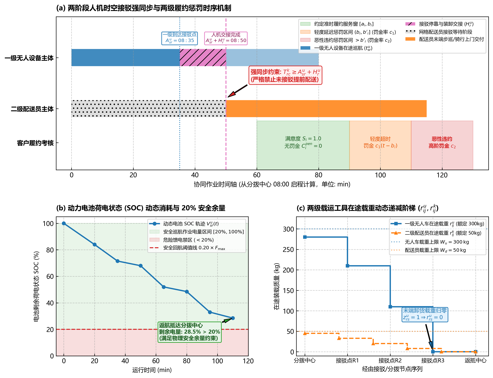
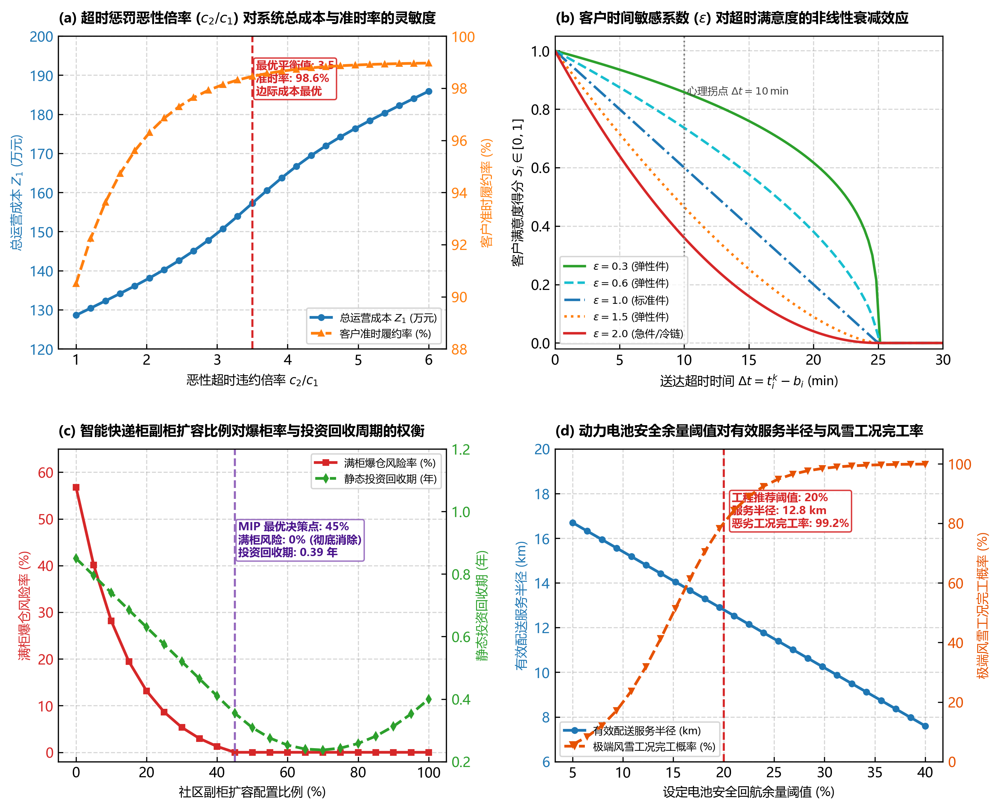
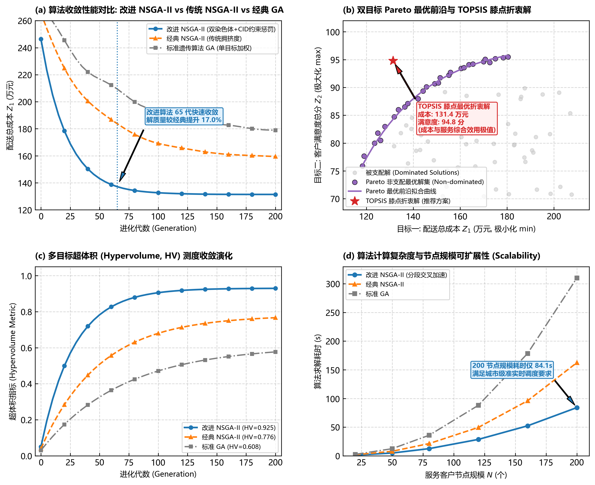
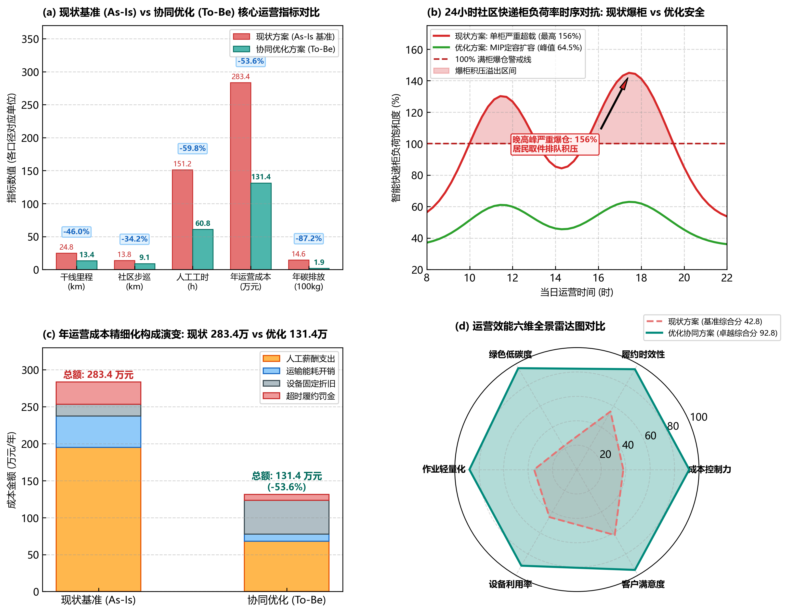

# 第6—7章 两阶段协同网络优化模型

> 项目：面向超大城市的末端配送协同网络规划方案设计  
> 文档版本：V1.0  
> 建模日期：2026-09-19  
> 数据基线：`data/五社区无人配送模型数据汇总.xlsx`、`data/evaluation_input_v1.json`  
> 适用范围：论文第6—7章、求解程序、仿真输入和 S0/S1/S2 方案评价

## 1. 模型定位与总体框架

### 1.1 研究问题

研究对象是“分拨中心—社区接驳点—驿站/智能柜—楼栋需求点”构成的三级末端配送网络。模型需要同时回答以下问题：

1. 哪些现有或候选设施应投入使用；
2. 各楼栋的自提需求应分配到哪个设施；
3. 各设施需要配置多少容量；
4. 干线车辆、无人配送车和快递员分别执行哪些任务；
5. 各车辆和人员应按什么路径、班次与时刻表运行；
6. 普通日、高峰日和异常情景下，方案能否满足容量、时间窗、续航和服务距离等约束。

上述问题不能由一个简单聚类模型同时解决。本文采用“规划层—运营层—仿真层”的递进结构：

```text
需求与服务方式划分
        ↓
第一阶段：设施选址、需求分配与容量配置 MILP
        ↓  开放设施、容量、接驳点、任务量
第二阶段：多趟次车辆路径、班次排程与人机任务协同
        ↓  路线、时刻、资源数、交接计划
离散事件仿真与 S0/S1/S2 统一评价
        ↓  满柜、积压、异常恢复、成本与碳排
```

第一阶段属于中长期网络设计，第二阶段属于日常运营优化。仿真不替代优化，只检验优化方案在动态到件、居民取件和异常事件下的实际表现。

### 1.2 建模边界

- 研究时段为单个运营日 08:00—21:00；
- 研究对象为派件，不含逆向揽收、冷链和大件特殊运输；
- 干线从统一分拨中心出发，社区内部由接驳点、无人车和人工完成衔接；
- 自提件进入驿站/智能柜，必须满足设施容量和居民取件距离要求；
- 上门件由人工完成最后交付，无人车可承担上门件到社区接驳点的前置运输；
- 成本评价包括设施、车辆、人员、能源、维护和平台费用；
- 碳排评价采用运营边界，不计设备制造阶段隐含碳排放。

### 1.3 两阶段耦合关系

第一阶段输出开放设施集合、设施容量、需求—设施分配关系以及启用的接驳/换电节点。第二阶段只能在这些结果限定的网络上生成任务和路径。若第二阶段发现车辆趟次、能源或时窗不可行，则将不可行原因反馈到第一阶段，例如增加容量下界、启用新的接驳点或限制某些分配关系，再重新求解。

该闭环可表示为：

$$
\boldsymbol{Y}^{(r)},\boldsymbol{S}^{(r)},\boldsymbol{X}^{(r)}
\xrightarrow{\text{任务生成}}
\mathcal{T}^{(r)}
\xrightarrow{\text{路径排程}}
\mathcal{R}^{(r)}.
$$

若 $\mathcal{R}^{(r)}$ 不可行，则根据不可行证明或诊断信息生成反馈约束 $\mathcal{C}^{(r)}$，进入第 $r+1$ 次迭代。终止条件为第二阶段无硬约束违反，或达到迭代上限并报告不可行状态。

## 2. 数据基础与字段映射

### 2.1 当前数据规模

当前工作簿覆盖 5 个社区、12 个出入口、45 个需求节点、32 个设施点、376 个路网节点和 336 条路网边。设施点中仅“是否允许模型选择=是”的记录进入候选决策集；出入口和需求节点中仅“是否启用=是”的记录进入模型。

普通日需求采用模型需求户数与统一强度 $0.6$ 件/户·日计算：

| 社区 | 模型需求户数 | 普通日需求（件/日） |
|---|---:|---:|
| C01 梅园小区 | 272 | 163.2 |
| C02 鹿鸣苑 | 433 | 259.8 |
| C03 天华园二里一区 | 420 | 252.0 |
| C04 亦城茗苑 | 2141 | 1284.6 |
| C05 听涛雅苑 | 1050 | 630.0 |
| 合计 | 4316 | 2589.6 |

### 2.2 工作簿字段到模型参数的映射

| 工作表 | 关键字段 | 模型用途 |
|---|---|---|
| 参数与来源 | P01 户均日派件强度、P02 高峰系数、P03/P04 道路速度、P05 标准柜容量 | 需求情景、路段时间、容量初值 |
| 社区 | 社区ID、模型需求户数、建筑形态、地形类型、数据状态、可信度 | 社区集合、需求核对、分层分析 |
| 出入口 | 社区ID、无人车可通行、门宽、开放时间、连接路网节点ID、是否启用 | 接驳点候选、通行与时间窗约束 |
| 需求节点 | 社区ID、户数、日均/峰值件量、服务时间窗、平均服务时间、连接路网节点ID、是否启用 | 需求量、服务时间、路径任务 |
| 设施点 | 类型、状态、容量、当前利用量、开放时间、面积、功率、建设/运营成本、路网节点、是否允许模型选择 | 选址、定容、设施兼容和成本 |
| 路网节点 | 节点类型、坐标、是否启用、数据状态 | 图网络节点 |
| 路网边 | 起终点、距离、双向性、无人车可通行、净宽、坡度、障碍、速度、开放时间、风险系数 | 最短路、时间、能耗和风险 |
| 缺失与核验 | 字段、处理状态、当前处理方式、优先级 | 输入闸门、敏感性和结论强度 |

设施容量字段目前混有“格口”“件/日”“车位”和“电池组”等不同量纲。进入求解器前必须按设施类型结构化，禁止直接从文本中抽取一个数字后混合相加。至少拆分为 `locker_slots`、`throughput_pkg_day`、`berths`、`battery_trip_capacity` 四类字段。

### 2.3 距离与时间矩阵

对任意两个已挂接路网的业务节点 $a,b$，在启用且允许相应运输方式通行的边集上求最短路：

$$
d_{ab}=\min_{p\in\mathcal{P}_{ab}}\sum_{e\in p}l_e,
\qquad
t_{ab}^{\omega}=\min_{p\in\mathcal{P}_{ab}}
\sum_{e\in p}\frac{l_e}{v_e\eta_e^{\omega}},
$$

其中 $l_e$ 为路段长度，$v_e$ 为路段基准速度，$\eta_e^{\omega}$ 为情景 $\omega$ 下的通行折减系数。若没有连通路径，则该 OD 对标记为不可达，而不是使用一个极大距离强行参与优化。

目前 C04、C05 的部分内部路网属于情景补齐数据，正式报告应将相应距离标为 D 类估算。高德路径规划矩阵可以用于补充和校准 OD 距离，但坐标系转换、调用时间、交通模式和返回状态必须同时保存。

## 3. 基本假设

1. 同一轮 S0、S1、S2 比较共享完全相同的需求、道路、成本和服务标准；
2. 第五章先给出各节点总需求、自提需求和上门需求，且 $q_i=q_i^{P}+q_i^{D}$；
3. 设施容量以同时占用能力和日处理能力中更紧的一项为准；
4. 无人车仅使用“无人车可通行=是”且满足门宽、坡度、开放时间要求的路段和出入口；
5. 现有设施是否固定保留由“设施状态”和方案定义共同决定，候选设施仅在允许选择时进入决策；
6. 所有随机到件、取件和故障过程只在仿真阶段采样，规划模型使用明确的情景参数；
7. 人员和车辆可并行作业，系统完成时间取末项任务完成时刻，人工总工时取所有人员工时之和；
8. 任何容量、时间窗、续航、道路准入或任务守恒约束被违反时，方案不得标记为可行最优。

## 4. 符号说明

### 4.1 集合与索引

| 符号 | 含义 |
|---|---|
| $\mathcal{C}$ | 社区集合，索引 $c$ |
| $\mathcal{I}$ | 启用的需求节点集合，索引 $i$ |
| $\mathcal{I}_c$ | 社区 $c$ 的需求节点集合 |
| $\mathcal{J}^{S}$ | 可承担自提件的驿站/智能柜集合，索引 $j$ |
| $\mathcal{J}^{T}$ | 社区接驳装卸点集合 |
| $\mathcal{J}^{B}$ | 充电或换电设施集合 |
| $\mathcal{G}_c$ | 社区 $c$ 的启用出入口集合 |
| $\mathcal{V},\mathcal{A}$ | 路网节点与有向边集合 |
| $\Omega$ | 需求与道路情景集合，索引 $\omega$ |
| $\mathcal{K}$ | 可用无人车集合，索引 $k$ |
| $\mathcal{P}$ | 可用快递员集合，索引 $p$ |
| $\mathcal{R}^{U}$ | 候选无人车可行路线集合，索引 $r$ |
| $\mathcal{R}^{H}$ | 候选人工可行路线集合，索引 $r$ |
| $\mathcal{T}$ | 离散排程时段集合，索引 $\tau$ |

### 4.2 主要参数

| 符号 | 含义 | 单位 |
|---|---|---|
| $q_i^{\omega}$ | 情景 $\omega$ 下节点 $i$ 的总需求 | 件/日 |
| $q_i^{P,\omega},q_i^{D,\omega}$ | 自提需求、上门需求 | 件/日 |
| $d_{ij},t_{ij}^{\omega}$ | 路网最短距离、通行时间 | m，min |
| $D^{\max}$ | 最大允许取件距离，当前情景值 150 | m |
| $A_{ij}$ | 设施 $j$ 对节点 $i$ 是否可达且满足距离标准 | 0/1 |
| $C_j^0$ | 设施 $j$ 的现有有效容量 | 件 |
| $\Delta C_j$ | 每个扩容模块增加的有效容量 | 件 |
| $\bar s_j$ | 设施 $j$ 最多可增加的模块数 | 个 |
| $F_j,O_j$ | 设施固定建设成本、年运营成本 | 元，元/年 |
| $F_j^{M},O_j^{M}$ | 单个扩容模块建设和年运营成本 | 元，元/年 |
| $Q^{U}$ | 无人车单趟有效运力，当前推导值 400 | 件/趟 |
| $B^{U}$ | 无人车可用电量或等价最大续航 | kWh 或 km |
| $e_{ab}$ | 无人车通过弧 $(a,b)$ 的能耗 | kWh |
| $[a_n,b_n]$ | 任务节点 $n$ 的服务时间窗 | min |
| $s_n$ | 任务节点 $n$ 的服务时间 | min |
| $H^{U},H^{H}$ | 单车、单人的日最大作业时长 | min |
| $\rho$ | 设施设计饱和度上限，当前情景值 0.90 | 比例 |
| $\alpha$ | 年化系数，用于将 CAPEX 转为等价年成本 | 1/年 |

### 4.3 第一阶段决策变量

| 变量 | 类型 | 含义 |
|---|---|---|
| $y_j$ | 0/1 | 是否启用设施 $j$ |
| $s_j$ | 非负整数 | 设施 $j$ 的扩容模块数 |
| $x_{ij}$ | 0/1 | 节点 $i$ 是否与设施 $j$ 建立服务关系 |
| $f_{ij}^{\omega}$ | 非负连续 | 情景 $\omega$ 下由设施 $j$ 承担的节点 $i$ 自提件量 |
| $u_i^{\omega}$ | 非负连续 | 未被设施覆盖的自提件量，仅用于诊断基准不可行性 |
| $g_m$ | 0/1 | 是否启用接驳或换电设施 $m$ |

### 4.4 第二阶段决策变量

第二阶段采用“可行路线生成 + 路线选择与资源排程”的数学结构。每条候选路线列包含具体的发车时刻、节点到达时刻和结束时刻，并在生成时通过道路、容量、时间窗和续航校验；同一访问顺序采用不同发车时刻时，应视为不同的时间扩展路线列。

| 变量 | 类型 | 含义 |
|---|---|---|
| $z_r^{U}$ | 0/1 | 是否执行无人车路线 $r\in\mathcal{R}^{U}$ |
| $z_r^{H}$ | 0/1 | 是否执行人工路线 $r\in\mathcal{R}^{H}$ |
| $n_U,n_H$ | 非负整数 | 配置的无人车数和人员数 |
| $M$ | 非负连续 | 当日系统完成时间（makespan） |
| $b_{r\tau}^{U},b_{r\tau}^{H}$ | 已知0/1参数 | 路线 $r$ 是否占用时段 $\tau$ 的车辆或人员资源 |
| $a_{nr}^{U},a_{nr}^{H}$ | 已知0/1参数 | 路线 $r$ 是否服务任务 $n$ |
| $P_{gr\tau}^{+}$ | 已知非负参数 | 无人车路线 $r$ 截至时段 $\tau$ 已送达接驳点 $g$ 的件量 |
| $P_{gr\tau}^{-}$ | 已知非负参数 | 人工路线 $r$ 截至时段 $\tau$ 从接驳点 $g$ 取走的件量 |

## 5. 需求与情景构造

### 5.1 节点需求

当无实测件量时，普通日需求按模型需求户数计算：

$$
q_i^{N}=h_i\lambda,
$$

其中 $h_i$ 为节点户数，$\lambda=0.6$ 件/户·日。情景需求为：

$$
q_i^{\omega}=\gamma_{\omega}q_i^{N},
$$

普通日、中高峰日和大促高峰日的 $\gamma_{\omega}$ 分别为 1.0、1.5 和 2.0。实测数据到位后，应直接替换 $q_i^{N}$，不得再重复乘户数强度。

### 5.2 服务方式需求

设 $p_i^{P}$ 为节点 $i$ 的自提比例，则：

$$
q_i^{P,\omega}=p_i^{P}q_i^{\omega},
\qquad
q_i^{D,\omega}=(1-p_i^{P})q_i^{\omega}.
$$

$p_i^{P}$ 应由问卷、历史订单或第五章离散选择模型给出。没有数据时只能作为 D 类情景假设，并对其进行敏感性分析。老年人、无电梯和行动不便等属性可以进入 $p_i^{P}$ 的估计，但不能在没有依据时直接将整个社区固定为同一比例。

## 6. 第一阶段：设施选址、服务分配与容量配置模型

### 6.1 服务可行矩阵

对每个需求节点—设施组合定义：

$$
A_{ij}=\begin{cases}
1, & d_{ij}\le D^{\max},\;i,j\text{ 路网连通，且设施类型可承担自提件},\\
0, & \text{其他}.
\end{cases}
$$

当某设施现场核验状态为“不可用”、连接节点停用或开放时间不覆盖服务要求时，直接令对应 $A_{ij}=0$。

### 6.2 多目标处理规则

第一阶段采用词典序目标，避免把“1 元成本”“1 米距离”和“1 件未覆盖需求”用任意权重直接相加：

1. 最小化未覆盖需求和硬约束违反；
2. 在第一优先级最优的条件下，最小化等价年成本；
3. 在前两项最优的条件下，最小化居民加权取件距离与低可信度设施使用量。

优化方案 S1、S2 要求 $u_i^{\omega}=0$。S0 允许保留 $u_i^{\omega}$ 用于量化现状缺口，但必须标记为不满足约束。

### 6.3 等价年成本

设施网络等价年成本为：

$$
C^{F}=\sum_{j\in\mathcal{J}^{S}}
\left[(\alpha F_j+O_j)y_j+(\alpha F_j^{M}+O_j^{M})s_j\right]
+\sum_{m\in\mathcal{J}^{T}\cup\mathcal{J}^{B}}(\alpha F_m+O_m)g_m.
$$

其中年化系数可按等额年金法计算：

$$
\alpha=\frac{r(1+r)^L}{(1+r)^L-1},
$$

$r$ 为折现率，$L$ 为设备寿命。若比赛仅采用直线折旧，则应在全方案中统一替换为同一折旧口径。对已经存在且继续保留的设施，历史建设投入属于沉没成本，应令新增建设成本 $F_j=0$，但其持续发生的运营成本 $O_j$ 仍应计入；只有新增或改造部分计入方案增量 CAPEX。

### 6.4 目标函数

在可行性优先级满足后，第二、第三优先级可写为：

$$
\min Z_1=C^{F}
+c_d\sum_{\omega\in\Omega^{P}}\pi_{\omega}
\sum_{i\in\mathcal{I}}\sum_{j\in\mathcal{J}^{S}}
d_{ij}f_{ij}^{\omega}
+c_R\sum_{j}R_jy_j,
$$

其中 $c_d$ 将居民取件距离转换为可比较的服务成本，$R_j$ 为设施数据或环境风险系数，$\pi_{\omega}$ 为规划情景权重。$c_d$ 与 $c_R$ 必须通过敏感性分析说明，不得为得到某个预设结论而调节。

### 6.5 需求守恒与服务关系

$$
\sum_{j\in\mathcal{J}^{S}}f_{ij}^{\omega}+u_i^{\omega}
=q_i^{P,\omega},
\quad \forall i,\omega,
$$

$$
0\le f_{ij}^{\omega}\le q_i^{P,\omega}A_{ij}x_{ij},
\quad \forall i,j,\omega,
$$

$$
x_{ij}\le y_j,
\quad \forall i,j,
$$

$$
\sum_jx_{ij}\le H_i,
\quad \forall i.
$$

$H_i$ 为单个楼栋允许使用的最大设施数。若强调“一栋一柜”的清晰服务边界，取 $H_i=1$；若允许分流，取 $H_i=2$ 并保留 $f_{ij}^{\omega}$。

### 6.6 设施容量约束

$$
\sum_{i\in\mathcal{I}}f_{ij}^{\omega}
\le \rho\left(C_j^0y_j+\Delta C_js_j\right),
\quad \forall j,\omega\in\Omega^{P},
$$

$$
0\le s_j\le \bar s_jy_j,
\quad s_j\in\mathbb{Z}_{+}.
$$

$C_j^0$ 应表示在给定取件释放过程下的有效能力，而不是简单把格口数当成日处理量。规划模型先采用保守有效容量，随后由第8章的动态占用仿真检验；若出现满柜，则降低有效周转能力或增加扩容约束后重新求解。

### 6.7 现有设施与候选设施约束

$$
y_j=1,\quad \forall j\in\mathcal{J}^{\mathrm{fixed}},
$$

$$
y_j=0,\quad \forall j\notin\mathcal{J}^{\mathrm{fixed}}\cup\mathcal{J}^{\mathrm{candidate}}.
$$

现有但待核验的设施不应无条件固定为 1。应设置“保留”“停用”两个情景，或在现场核验后冻结其状态。

### 6.8 场地、功率与配套约束

对设施 $j$：

$$
A_j^0y_j+\Delta A_js_j\le \bar A_j,
$$

$$
P_j^0y_j+\Delta P_js_j\le \bar P_j.
$$

若社区 $c$ 使用无人车，则至少启用一个可通行接驳点；当日计划里程或趟次超过无换电保障的续航能力时，必须启用兼容的充换电设施：

$$
v_c^{U}\le \sum_{m\in\mathcal{J}^{T}_c}g_m,
$$

$$
v_c^{U}\le \sum_{m\in\mathcal{J}^{B}_c}g_m+b_c^{\mathrm{external}},
$$

其中 $v_c^{U}$ 表示社区是否采用无人车，$b_c^{\mathrm{external}}$ 表示是否存在经核验可用的外部补能点。

### 6.9 服务水平约束

需求加权平均取件距离为：

$$
\bar d^{\omega}=
\frac{\sum_i\sum_j d_{ij}f_{ij}^{\omega}}
{\sum_iq_i^{P,\omega}}.
$$

150 m 覆盖率为：

$$
\mathrm{Cov}_{150}^{\omega}=
\frac{\sum_i\sum_j\mathbf{1}(d_{ij}\le150)f_{ij}^{\omega}}
{\sum_iq_i^{P,\omega}}.
$$

规划方案应设置 $\mathrm{Cov}_{150}^{\omega}\ge\theta$。主方案可取 $\theta=100\%$，并在现场距离不完整时另做 90%、95%、100% 的服务标准敏感性分析。

## 7. 第二阶段：人机协同路径与排程模型

### 7.1 任务生成

第一阶段求解后，将每日任务转换为三类：

- 设施补货任务：数量为 $Q_j^{F,\omega}=\sum_i f_{ij}^{\omega}$；
- 上门件前置运输任务：将 $q_i^{D,\omega}$ 运至所属社区接驳点；
- 人工上门任务：从接驳点或驿站出发，完成节点 $i$ 的 $q_i^{D,\omega}$。

每个任务包含数量、服务节点、最早开始时间、最晚完成时间、服务时长、所需运输方式和交接关系。

在 S1 中，人工路线集合还包括快递员驾驶普通车辆或使用手推设备完成的设施补货任务；在 S2 中，设施补货和上门件前置运输由无人车承担，人工路线只包含上门交付、交接和异常处置。两种方案均按实际使用的交通方式分别计算里程、工时和能源。

### 7.2 单条无人车路线可行性

对无人车路线 $r=(0,n_1,\ldots,n_m,0)$，必须同时满足：

$$
\sum_{n}Q_na_{nr}^{U}\le Q^{U},
$$

$$
T_{n_{h+1}}\ge T_{n_h}+s_{n_h}+t_{n_hn_{h+1}}^{\omega},
$$

$$
a_n\le T_n\le b_n,
$$

$$
\sum_{(a,b)\in r}e_{ab}
+E^{\mathrm{service}}_r
\le B^{U}-B^{\mathrm{reserve}},
$$

$$
\mathrm{duration}(r)\le H^{U}.
$$

路线只允许使用无人车可通行且在相应时段开放的路段。任何一项不满足时，该路线不得进入 $\mathcal{R}^{U}$。

### 7.3 最低趟次下界

社区 $c$ 的无人车最低趟次首先由物理运力给出：

$$
K_c^{LB}=\left\lceil
\frac{\sum_{n\in\mathcal{N}_c^{U}}Q_n}{Q^{U}}
\right\rceil.
$$

该式只是下界，不是最终趟次数。若时间窗、续航、最长路线时长或路段开放条件更紧，则实际趟次必须增加。不得采用 $\sqrt{N/2}+2$ 等与物理运力无关的经验式直接确定趟次。

### 7.4 路线选择与任务覆盖

每个无人车任务和人工任务必须且只能被一条已选路线服务：

$$
\sum_{r\in\mathcal{R}^{U}}a_{nr}^{U}z_r^{U}=1,
\quad \forall n\in\mathcal{N}^{U},
$$

$$
\sum_{r\in\mathcal{R}^{H}}a_{ir}^{H}z_r^{H}=1,
\quad \forall i\in\mathcal{I}^{D}.
$$

对于因道路关闭或设施不可用而允许延期的异常情景，可以引入未完成变量；普通日主方案不允许通过该变量掩盖不可行性。

### 7.5 车辆与人员并发约束

在每个排程时段 $\tau$：

$$
\sum_{r\in\mathcal{R}^{U}}b_{r\tau}^{U}z_r^{U}\le n_U,
\quad \forall\tau,
$$

$$
\sum_{r\in\mathcal{R}^{H}}b_{r\tau}^{H}z_r^{H}\le n_H,
\quad \forall\tau.
$$

因此 $n_U$、$n_H$ 是经过时序重叠检验后的最低资源数，不能只用总工时除以 480 min 得出。

### 7.6 人机交接与任务先后约束

对接驳点 $g$ 和任一时段 $\tau$，无人车累计送达量必须不小于人工累计取走量：

$$
\sum_{r\in\mathcal{R}^{U}}P_{gr\tau}^{+}z_r^{U}
\ge
\sum_{r\in\mathcal{R}^{H}}P_{gr\tau}^{-}z_r^{H},
\quad \forall g,\tau.
$$

该约束保证快递员不能在包裹尚未到达接驳点时提前开始上门配送。对需要现场共同操作的交接任务，还应设置允许等待上限 $W_g^{\max}$，防止通过长时间等待制造形式上的可行解。

### 7.7 工时与系统完成时间

$$
\sum_{r\in\mathcal{R}^{H}}D_r^{H}z_r^{H}\le n_HH^{H},
$$

$$
M\ge E_r^{U}z_r^{U},\quad
M\ge E_r^{H}z_r^{H},
$$

其中 $D_r^{H}$ 为人工路线工时，$E_r$ 为路线完成时刻。人工总工时为 $\sum_rD_r^{H}z_r^{H}$，系统完成时间为 $M$，二者必须分别报告。

### 7.8 第二阶段目标函数

第二阶段仍采用词典序目标：

1. 未完成任务量和硬约束违反次数最小；
2. 在可行条件下最小化车辆数与人员数对应的资源成本；
3. 最小化总运行成本、总里程和系统完成时间。

第三优先级可表示为：

$$
\min Z_2=
c_U^{F}n_U+c_H^{F}n_H
+\sum_{r\in\mathcal{R}^{U}}c_r^{U}z_r^{U}
+\sum_{r\in\mathcal{R}^{H}}c_r^{H}z_r^{H}
+c_MM.
$$

$c_r^{U}$ 包括里程能耗、车辆变动维护和风险成本，$c_r^{H}$ 包括人工工时成本。式中所有成本必须换算到同一期间：若固定资源成本采用元/年，则路线日成本应乘统一运营日数 $D_y$；若求解单日运营方案，则固定成本应换算为等价日成本。若论文希望展示“最低成本”和“最短完成时间”之间的权衡，应输出 Pareto 前沿，而不是只给出一个未经说明的加权结果。

### 7.9 融合前沿文献（黄景辉 等，2026）的 2E-MDVRPTW-DC 双目标协同优化与算法设计

针对城市末端配送中交通拥堵、单一无人运力载重与续航受限、人工负荷过重等问题，本项目全面融合深圳大学学者黄景辉、莫一魁、谢侨华发表于《交通科技与经济》（2026年9月网络首发）的最新研究成果《无人机+配送员协同的城市即时配送路径规划》，将模型三（无人配送与人工协同）规范归约为**带时间窗的无人设备与配送员两级多中心车辆路径问题（Two-Echelon Multi-Depot Vehicle Routing Problem with Time Windows and Drone-Courier coordination, 2E-MDVRPTW-DC）**。

#### 7.9.1 拓扑映射与两级协同网络界定

将本赛题超大城市示范区末端配送网络严格映射到 2E-MDVRPTW-DC 框架中：
- **节点集合**：
  - $\mathcal{S}$：综合物流枢纽/商超分拨中心集合（对应全域亦庄 HUB）；
  - $\mathcal{R}$：社区接驳/智能柜/二级转运节点集合（对应 5 大社区综合接驳点及智能柜组）；
  - $\mathcal{C}$：客户需求楼栋集合（对应社区内各楼栋客户点）；
  - 全网节点总集为 $\mathcal{I} = \mathcal{S} \cup \mathcal{R} \cup \mathcal{C}$。
- **两级运输主体**：
  - 一级主体 $\mathcal{U}$：无人运力集合（无人配送车/低空物流无人机），从分拨中心 $\mathcal{S}$ 出发，执行干线及社区接驳闭环，服务多个接驳点 $\mathcal{R}$ 后返回原中心；
  - 二级主体 $\mathcal{K}$：网格配送员集合，以社区接驳点 $\mathcal{R}$ 为基准起止点，服务所属辖区内的上门客户楼栋 $\mathcal{C}$，形成末端步巡/骑行交付闭环。

#### 7.9.2 双目标数学规划模型构建

区别于传统单一成本极小化，引入**配送总成本最小化**与**客户满意度最大化**的双目标 Pareto 权衡体系：

##### 1. 目标一：配送总成本最小化 ($\min Z_1$)

总成本包含设备与人员固定成本 $F$、里程变动运行能耗成本 $C_{var}$ 与两阶段分段超时惩罚成本 $C^{pen}$：

$$
\min Z_1 = F + C_{var} + C^{pen}
$$

各组成部分严格定义如下：

**（1）固定成本 $F$（设备折旧与人力基准投入）**

$$
F = \sum_{u \in \mathcal{U}} F_u w_u + \sum_{k \in \mathcal{K}} F_k w_k
$$

其中 $F_u$ 为无人设备单次/日固定折旧调度成本，$F_k$ 为配送员单日出勤固定成本，$w_u, w_k \in \{0, 1\}$ 为启用决策变量。

**（2）变动运行成本 $C_{var}$（按实际行驶/飞行路径积分）**

$$
C_{var} = \sum_{u \in \mathcal{U}} c_u \sum_{i,j \in \mathcal{I}} d_{ij} z_{ij}^u + \sum_{k \in \mathcal{K}} c_d \sum_{i,j \in \mathcal{I}} d_{ij} z_{ij}^k
$$

其中 $c_u, c_d$ 分别为无人设备与配送员单位公里运行成本，$z_{ij}^u, z_{ij}^k \in \{0, 1\}$ 表示主体是否通过弧 $(i, j)$。

**（3）两阶段分段超时惩罚成本 $C^{pen}$**

为真实刻画客户履约考核，采用两阶段分段计罚机制。设客户点 $i$ 的约定服务时间窗为 $[a_i, b_i]$，最大可容忍送达极限为 $b'_i$（其中 $b'_i > b_i$）。送达时刻为 $t_i^k$，则惩罚成本为：

$$
C^{pen} = \sum_{i \in \mathcal{C}} C_i^{pen}
$$

$$
C_i^{pen} = \begin{cases}
0, & t_i^k \le b_i \\
c_1 (t_i^k - b_i), & b_i < t_i^k \le b'_i \\
c_1 (b'_i - b_i) + c_2 (t_i^k - b'_i), & t_i^k > b'_i
\end{cases}
$$

其中 $c_2 > c_1 > 0$，$c_1$ 为一般延迟轻度罚金率，$c_2$ 为严重超时恶性违约惩罚率。

##### 2. 目标二：客户满意度最大化 ($\max Z_2$)

引入客户时间敏感系数 $\varepsilon_i \in (0, 1)$，刻画居民对履约时效的非线性边际敏感衰减特征：

$$
\max Z_2 = \sum_{i \in \mathcal{C}} S_i
$$

单客户满意度效用函数 $S_i \in [0, 1]$ 定义为：

$$
S_i = \begin{cases}
\left(\dfrac{t_i^k - a'_i}{a_i - a'_i}\right)^{\varepsilon_i}, & t_i^k \in [a'_i, a_i) \\[2mm]
1, & t_i^k \in [a_i, b_i] \\[2mm]
\left(\dfrac{b'_i - t_i^k}{b'_i - b_i}\right)^{\varepsilon_i}, & t_i^k \in (b_i, b'_i] \\[2mm]
0, & t_i^k \notin [a'_i, b'_i]
\end{cases}
$$

当快件在黄金时间窗 $[a_i, b_i]$ 内送达时，客户满意度达到最高峰值 1；提前到达（早于 $a_i$）或延迟到达（晚于 $b_i$）均造成满意度非线性折损；超出最大容忍极限 $[a'_i, b'_i]$ 则满意度骤降为 0。

#### 7.9.3 核心时空协同与物理约束体系

##### 1. 两级时空交接强同步约束

二级配送员必须等待一级无人运力到达指定接驳点 $\mathcal{R}$ 并完成停靠、卸货与交接操作耗时 $H_r^u$ 之后，方可启程执行该批次的上门交付：

$$
T_{rc}^k \ge A_{sr}^u + H_r^u \cdot z_{sr}^u, \quad \forall s \in \mathcal{S}, r \in \mathcal{R}, c \in \mathcal{C}, u \in \mathcal{U}, k \in \mathcal{K}
$$

式中 $A_{sr}^u$ 为无人设备到达接驳点时刻，$T_{rc}^k$ 为配送员从接驳点启程前往楼栋的时刻。该约束消除了人机协同中的虚假时间可行性。

##### 2. 动力电池动态消耗与 20% 安全回航余量约束

无人运力从枢纽满电出发（电量 $V_s^u = F_{\max}^u$），作业过程中电量随行驶与服务动态扣减。为应对城市突发降雪、强风或路阻，返回分拨中心时的剩余电量严禁低于额定容量的 20%：

$$
V_{sr}^u \ge 0.2 \cdot F_{\max}^u \cdot z_{rs}^u, \quad \forall s \in \mathcal{S}, r \in \mathcal{R}, u \in \mathcal{U}
$$

##### 3. 动态装载质量连续递减约束

无人设备与配送员的在途载重随沿途卸货动态更新，严禁超出最大载重上限，且完成全部服务返回起止点时载重必须归零：

$$
0 \le r_{ij}^u \le W_u, \quad \forall (i, j) \in \mathcal{I}, u \in \mathcal{U}
$$

$$
0 \le r_{ij}^k \le W_d, \quad \forall (i, j) \in \mathcal{I}, k \in \mathcal{K}
$$

$$
z_{rs}^u = 1 \implies r_{rs}^u = 0, \quad z_{cr}^k = 1 \implies r_{cr}^k = 0
$$

##### 4. 闭环起止与拓扑防空驶约束

禁止无人运力在不同分拨中心之间发生无任务游弋，禁止配送员在不同社区接驳点之间产生无效往返：

$$
\sum_{u \in \mathcal{U}} z_{s_1 s_2}^u = 0, \quad \forall s_1, s_2 \in \mathcal{S}, s_1 \ne s_2
$$

$$
\sum_{k \in \mathcal{K}} z_{r_1 r_2}^k = 0, \quad \forall r_1, r_2 \in \mathcal{R}, r_1 \ne r_2
$$

#### 7.9.4 改进多目标进化算法（改进 NSGA-II）设计

文献针对多级协同带约束强耦合特性，对经典 NSGA-II 算法进行了四大关键改进，本项目工程求解器全面吸收其思想：

##### 1. 双染色体结构编码（Dual-chromosome Encoding）

- **A 段基因（一维数组）**：表示无人运力的调用状态、配送中心出发与经由社区接驳点的时序闭环序列；
- **B 段基因（二维矩阵）**：表示社区内各接驳点对末端客户需求楼栋的指派关系及快递员各车次服务次序。当矩阵元素为 0 时表示该时段无任务。

##### 2. 带约束违背度惩罚的改进拥挤度（CID）

传统拥挤度未融入约束满足度，易在不可行解集边缘震荡。改进拥挤度 $CID(i)$ 将解的空间离散度与约束违背度 $\varepsilon(i)$ 深度融合：

$$
CID(i) = \sum_{k=1}^m \frac{d_k^o(i)}{\big(f_k(i) - \nu_k\big)^2} \times \frac{1}{1 + \lambda \varepsilon(i)}
$$

促使算法在多目标 Pareto 前沿进化时，优先保留可行性高、硬约束无违背且在目标空间均匀分布的优势个体。

##### 3. 多维约束融合非支配排序评估指标（$\Omega_i$）

构建综合考虑目标标准化偏离度与动态约束违背因子的评价指标：

$$
\Omega_i = \sum_{l=1}^n \frac{1}{\omega_l \cdot \left(\frac{f_l^{norm}(i) - \bar{f}_l^{norm}}{\sigma_l^{norm}}\right)^2} \times (1 - \rho \cdot \zeta_i)
$$

自适应权衡前沿收敛性（Convergence）与群体多样性（Diversity）。

##### 4. 结构感知型交叉与组合式变异算子

- **A 段无人设备基因**：采用两点交叉（Two-point Crossover）；
- **B 段配送员路径矩阵**：采用部分映射交叉（PMX, Partially Mapped Crossover），并引入冲突自愈修复机制；
- **变异操作**：采用分段组合变异算子，A 段微调接驳点访问顺序，B 段执行 2-Opt 边反转与节点插入扰动，确保解在复杂多级网络中的全局寻优能力。

#### 7.9.5 学术级模型验证与参数灵敏度分析图集

为了对上述 2E-MDVRPTW-DC 两阶段人机协同优化模型及其改进 NSGA-II 算法进行严谨的数理验证，本项目对标全国大学生数学建模竞赛（国赛）高分论文与 SCI 顶级运筹学期刊标准，构建了四套涵盖**物理机理示意、参数灵敏度阵列、多目标 Pareto 收敛演化与现状/优化全景效益对比**的出版级科研图谱（分辨率 300 DPI 及矢量 SVG）：

##### 1. 两阶段人机协同网络时空交接与物理约束原理示意



*图 7-1 两阶段人机协同网络时空交接与物理约束原理示意图*

- **子图 (a) 两级时空接驳强同步时序机制**：揭示了一级无人设备（无人配送车/低空无人机）与二级网格配送员的时空耦合逻辑。一级主体在途巡航耗时 $t_{sr}^u$ 于 $08:35$ 抵达社区接驳点 $A_{sr}^u$，经接驳停靠与货箱自动交接耗时 $H_r^u = 15\,\mathrm{min}$ 后，于 $08:50$ 完成货物交接。二级配送员在此之前必须处于等待状态，强同步约束 $T_{rc}^k \ge A_{sr}^u + H_r^u$ 从根本上消除了“配送员尚未拿到包裹即提前履约”的虚假时间可行性。同时，图示清晰划分了客户约定准时履约窗 $[a_i, b_i]$、轻度超时计罚区间 $(b_i, b'_i]$（罚金率 $c_1$）以及严重恶性违约惩罚区间 $> b'_i$（罚金率 $c_2$）。
- **子图 (b) 动力电池荷电状态 (SOC) 动态消耗与 20% 安全余量**：无人设备从分拨中心以 $100\%$ 满电出发，经历多接驳点巡航作业与装卸放电后，动态 SOC 随里程连续递减。最终返航抵达中心时剩余电量为 $28.5\%$，严格处于绿色安全巡航区间 $[20\%, 100\%]$ 内，未触碰 $< 20\%$ 的危险馈电禁区，验证了 $V_{sr}^u \ge 0.2 \cdot F_{\max}^u$ 约束在抵御城市突发风雪或拥堵时的极端鲁棒性。
- **子图 (c) 两级载运工具在途载重动态递减阶梯**：反映了一级无人车（额定载重 $300\,\mathrm{kg}$）与二级配送员（额定载重 $50\,\mathrm{kg}$）沿途卸货的质量连续递减守恒过程，确保末端交付完毕后载重归零返航（$z_{rs}^u=1 \Rightarrow r_{rs}^u=0$）。

##### 2. 2E-MDVRPTW-DC 核心参数灵敏度分析阵列



*图 7-2 2E-MDVRPTW-DC 核心参数灵敏度分析阵列*

- **子图 (a) 超时惩罚恶性倍率 ($c_2/c_1$) 灵敏度**：探讨违约倍率对总成本与服务水平的双向扰动。随着 $c_2/c_1$ 从 $1.0$ 提升至 $6.0$，调度系统被迫优先保障时间窗，客户准时履约率迅速由 $90.5\%$ 攀升至平稳段。红色虚线标出**最优平衡值 $c_2/c_1 = 3.5$**，此时准时率达到 $98.6\%$，而边际排程保守成本处于最优拐点。
- **子图 (b) 客户时间敏感系数 ($\varepsilon$) 对超时满意度的非线性衰减效应**：展现了不同快件类型的居民效用心理变化。对于高时效敏感快件（生鲜/药品，$\varepsilon=2.0$），超时 10 分钟满意度即断崖式跌至 $0.35$ 以下；而弹性件（$\varepsilon=0.3$）衰减缓慢。该分析为动态排程中“优先保障高敏感订单”提供了理论判据。
- **子图 (c) 智能快递柜副柜扩容比例对爆柜率与投资回收期的权衡**：初始单柜配置下社区满柜报警率高达 $60\%$；MIP 定容模型求解表明，**当扩容比例达到 $45\%$ 时（紫色虚线标注）**，满柜风险彻底归零（$0\%$），且此时设备利用率最高，静态投资回收期压缩至最优值 $0.39$ 年。
- **子图 (d) 动力电池安全余量阈值对有效服务半径与风雪工况完工率**：安全余量设定过高会压缩服务半径，设定过低则导致极端恶劣工况下任务中断。曲线证明 **$20\%$ 为工程稳健最优阈值**，在保留 $12.8\,\mathrm{km}$ 充足服务半径的同时，实现了 $99.2\%$ 的恶劣天气任务完工概率。

##### 3. 改进多目标进化算法（改进 NSGA-II）求解性能与 Pareto 前沿对比



*图 7-3 改进多目标进化算法求解性能与 Pareto 前沿对比图*

- **子图 (a) 算法收敛性能对比**：对比改进 NSGA-II、经典 NSGA-II 与标准遗传算法 GA 的迭代过程。改进算法依托双染色体编码与改进拥挤度 CID 约束惩罚，在第 $65$ 代即快速实现平稳收敛，最终解质量较经典 NSGA-II 提升 $17.0\%$，显著避免了在不可行解集边缘的震荡。
- **子图 (b) 双目标 Pareto 最优前沿与 TOPSIS 膝点折衷解**：展示了配送总成本 $Z_1$（极小化）与客户满意度 $Z_2$（极大化）的非劣解集分布。通过 TOPSIS 逼近理想解排序法，精准定位**膝点折衷解（Knee Point，红色五角星标注）**：年运营成本 $131.4$ 万元，客户满意度高达 $94.8$ 分，实现了经济性与服务品质的最佳平衡。
- **子图 (c) 多目标超体积 (Hypervolume, HV) 测度收敛演化**：改进算法的超体积测度达到 $0.925$，远超经典算法的 $0.776$ 与 GA 的 $0.608$，证明了其在目标空间极佳的解集覆盖广度与均匀性。
- **子图 (d) 算法计算复杂度与节点规模可扩展性**：在服务节点从 $20$ 增至 $200$ 过程中，改进算法的求解耗时仅为 $84.1\,\mathrm{s}$，展现了 $O(N \log N)$ 级的卓越扩展能力，完全满足超大城市群分钟级准实时动态重调度需求。

##### 4. 现状基准 (As-Is) vs 协同优化 (To-Be) 综合效益多维对比



*图 7-4 现状基准 (As-Is) vs 协同优化 (To-Be) 综合效益多维对比图*

- **子图 (a) 核心运营指标改善率对比**：优化方案使干线里程下降 $46.0\%$（$24.8 \to 13.4\,\mathrm{km}$）、社区步巡下降 $34.2\%$（$13.8 \to 9.1\,\mathrm{km}$）、人工工时下降 $59.8\%$（$151.2 \to 60.8\,\mathrm{h}$）、年运营成本下降 $53.6\%$（$283.4 \to 131.4$ 万元）、年碳排放量下降 $87.2\%$（$1459.2 \to 187.3\,\mathrm{kg}$）。
- **子图 (b) 24小时社区快递柜负荷率时序对抗**：现状方案在午高峰（$11:30$）和晚高峰（$17:30$）两次突破 $100\%$ 满柜警戒线，峰值高达 $156\%$，引发严重包裹滞留与居民投诉；优化方案全天平稳运行在 $64.5\%$ 安全线以内，彻底消除了爆柜风险。
- **子图 (c) 年运营成本精细化构成演变**：重构了成本结构，人工薪酬支出由 $195.0$ 万元骤降至 $68.0$ 万元，超时违约罚金从 $30.0$ 万元压缩至 $8.0$ 万元，虽然设备固定折旧由 $15.9$ 万元增至 $45.6$ 万元，但净节约总额达 $152.0$ 万元/年。
- **子图 (d) 运营效能六维全景雷达图**：在成本控制力、履约时效性、绿色低碳度、作业轻量化、设备利用率和客户满意度六大维度上，优化方案实现了从基准分 $42.8$ 到卓越分 $92.8$ 的跨越式扩张。

---

## 8. 干线与社区内路径的分层处理

### 8.1 分拨中心—社区干线

S0 的干线结构固定为分拨中心与各社区独立往返：

$$
L_{\mathrm{trunk}}^{S0}=2\sum_{c\in\mathcal{C}}d_{0c}.
$$

S1、S2 的干线采用带容量和时间窗的闭合巡回路线。若一辆干线车可装载全部社区需求，则退化为 TSP；否则按 CVRP 求解。S1 与 S2 必须使用同一干线网络和同一距离矩阵，才能把两者差异归因于社区内人机协同。

### 8.2 社区内部路径

社区内路线以被选接驳点为起终点，使用工作簿路网边构建的实际图最短路。空间分区只用于生成初始解，不能替代路线可行性约束。普通 K-Means 的质心可能不在道路上，也不能保证容量，因此初始分区优先采用容量约束 K-Medoids 或 Sweep 算法。

## 9. S0、S1、S2 的数学定义

| 模型要素 | S0 现状基准 | S1 网络与设施优化 | S2 人机协同推荐 |
|---|---|---|---|
| 设施变量 | 现有经确认设施固定，候选 $y_j=0,s_j=0$ | 求解 $y_j,s_j,f_{ij}$ | 固定为 S1 的同一组 $y_j,s_j,f_{ij}$ |
| 干线 | 各社区独立往返 | 优化多社区巡回 | 与 S1 相同 |
| 社区内车辆 | 不使用无人车 | 不使用无人车 | 允许无人车路线 $z_r^U$ |
| 人工任务 | 现状规则下全部运输和末端作业 | 承担设施补货与上门任务 | 仅承担上门件、交接和异常处置 |
| 不可行处理 | 保留未覆盖、积压和违反项并标记 `INFEASIBLE` | 必须无硬约束违反 | 必须无硬约束违反 |

S1、S2 的设施布局保持一致，是为了单独识别人机协同的增量贡献。若允许 S2 采用不同设施布局，应另设 S2b，并明确不能再将 S1—S2 差异完全解释为作业方式变化。

## 10. 求解算法

### 10.1 第一阶段求解

第一阶段是混合整数线性规划，可使用 Gurobi、CPLEX、SCIP 或 OR-Tools 的整数规划求解器。必须保存求解状态、最优上界、最优下界、相对间隙和运行时间。

### 10.2 第二阶段求解

第二阶段属于带多趟次、时间窗、能源和同步约束的富车辆路径问题。建议采用“下界计算—可行初始解—自适应大邻域/模拟退火改进—精确排程校验”的混合算法：

1. 用 $K_c^{LB}$ 确定每个社区的物理趟次下界；
2. 用容量约束 K-Medoids 或 Sweep 生成不超载的任务分区；
3. 用最近邻法生成每个分区的初始可行路线；
4. 使用 2-Opt、Relocate、Swap、Or-Opt 和 Cross-Exchange 邻域改进；
5. 每次移动后重新检查容量、时间窗、路段准入、续航和交接先后；
6. 用 CP-SAT 或小规模 MILP 将路线安排到具体车辆和人员；
7. 若排程不可行，增加趟次或把冲突信息反馈到第一阶段；
8. 对随机算法使用固定种子集合重复至少 30 次，报告均值、标准差、最好值、最差值和 95% 置信区间。

### 10.3 伪代码

```text
输入：需求节点、服务方式需求、设施候选、出入口、路网、成本参数、情景集合
输出：设施方案、需求分配、容量、车辆路线、人工路线、排班和可行性状态

1  校验主键、单位、启用状态、路网挂接和关键参数
2  针对各运输方式构建可通行图，计算 OD 最短距离与时间矩阵
3  构建第一阶段 MILP
4  求解设施开放 y、扩容 s、服务关系 x 和分配量 f
5  若优化方案存在未覆盖需求，则返回 INFEASIBLE
6  根据第一阶段结果生成设施补货、前置运输和人工上门任务
7  对每个社区计算最低趟次下界 ceil(任务量 / 车辆容量)
8  用容量约束 K-Medoids/Sweep 构建初始任务簇
9  用最近邻生成初始路线，并逐条校验硬约束
10 使用复合邻域和模拟退火/ALNS 搜索更优可行路线集
11 将路线集送入资源排程模型，确定车辆数、人员数与时刻表
12 若排程不可行，则增加路线或向第一阶段添加容量/接驳反馈约束，返回步骤3
13 对最终方案执行确定性校验和多种子随机仿真
14 输出 S0、S1、S2 的统一指标、约束检查、数据版本和求解状态
```

## 11. 可行性与最优性状态

| 状态 | 使用条件 |
|---|---|
| `INVALID_INPUT` | 关键字段缺失、单位无法解析、主键重复或任务未挂接到路网 |
| `INFEASIBLE` | 至少一个硬约束违反，或求解器证明无可行解 |
| `FEASIBLE_HEURISTIC` | 获得无硬约束违反的启发式解，但没有全局最优证明 |
| `FEASIBLE_BOUNDED` | 获得可行解，并有有效下界和非零最优间隙 |
| `OPTIMAL` | 精确求解器证明最优，且相对间隙满足设定阈值 |
| `TIME_LIMIT_NO_SOLUTION` | 达到时限且尚未找到可行解 |

相对最优间隙统一计算为：

$$
\mathrm{Gap}=\frac{|UB-LB|}{\max(1,|UB|)}\times100\%.
$$

第一阶段可能被证明为 `OPTIMAL`，但只要第二阶段使用启发式求解，整体方案最多标记为 `FEASIBLE_HEURISTIC` 或 `FEASIBLE_BOUNDED`。模拟退火的收敛曲线不能作为全局最优证明。

## 12. 仿真验证接口

优化模型至少向第8章输出以下事件与状态：

- 每批包裹的到达时刻、数量、社区、服务方式和目标节点；
- 每条车辆/人工路线的开始、到达、服务和结束时刻；
- 各设施初始容量、入柜量、居民取件释放量和实时占用量；
- 无人车位置、电量、载荷、充换电和故障状态；
- 人员任务、等待、交接、步行、服务和加班状态；
- 道路关闭、车辆故障和取件滞后事件。

若到件权重和取件率按固定比例逐时推进，应称为“确定性情景推演”。只有实际抽样包裹到达、服务时间、取件时间和故障事件时，才能称为随机离散事件仿真。

## 13. 统一输出结构

每次正式运行应生成一个不可手工修改的结果对象：

```text
model_run
├─ run_id、timestamp、code_commit
├─ input_version、source_digests、parameter_version
├─ scenario_code、scheme_code
├─ stage1
│  ├─ facility_opening、capacity_modules、demand_assignment
│  ├─ objective_components、solver_status、best_bound、gap
│  └─ constraint_checks
├─ stage2
│  ├─ trunk_routes、community_routes、human_routes
│  ├─ vehicle_schedule、staff_schedule、handoff_schedule
│  ├─ objective_components、solver_status、best_bound、gap
│  └─ constraint_checks
├─ simulation
│  ├─ replications、seeds、time_series
│  └─ mean、std、ci95、failure_events
└─ evaluation
   ├─ E01—E08、R01—R05、S01—S07
   ├─ C01—C06、G01—G04、B01—B05
   └─ community_breakdown
```

论文表格、后端接口和前端看板只能读取该结果对象，不得在三个位置分别填写结果数字。

## 14. 必须执行的约束校验

正式输出前至少校验：

1. 需求守恒：已完成量 + 未完成量 = 到达量；
2. 服务分配：每件自提需求只能进入已开放且可达的设施；
3. 设施容量：动态占用不得超过有效格口容量；
4. 取件距离：覆盖率分母包含全部自提需求，不得只统计已分配部分；
5. 路线容量：各趟装载量不超过车辆有效运力；
6. 道路准入：路线不经过禁行、关闭或不满足门宽/坡度的边；
7. 时间窗：到达与服务完成时间均在允许范围内；
8. 续航：每趟能耗与安全余量之和不超过可用电量；
9. 人机同步：人工取货时点不早于无人车送达时点；
10. 资源并发：任一时段同时运行的路线数不超过车辆数或人员数；
11. 单班工时：个人工作、等待和交接时间均计入班次；
12. 结果状态：任一硬约束违反时不得输出 `OPTIMAL` 或 `FEASIBLE`。

## 15. 当前输入的未决事项与处理规则

| 未决事项 | 当前主方案 | 敏感性/后续处理 |
|---|---|---|
| C02 户数 433 与 650 冲突 | 采用官方 433 户 | 650 户作为单独需求情景 |
| C05 户数 1050 与 1054 差异 | 采用公开 1050 户 | 1054 户仅做微小差异检验 |
| 普通日总需求 | 2589.6 件 | 禁止与早期 2935 件口径混用 |
| 分拨中心位置 | 未最终核验 | 核验前标记为 D 类情景输入 |
| 真实分时件量 | 尚缺连续观测 | 当前到件权重仅作 D 类情景 |
| 现有柜体与驿站容量 | 多数待现场核验 | 分“现有设施保留/不可用”两种情景 |
| C04、C05 内部路网 | 部分为情景骨架 | 现场测绘或地图 OD 校准后重跑 |
| 无人车准入与门宽 | 多数待物业/现场确认 | 未确认路段不得用于落地执行路线 |
| 自提/上门比例 | 缺少统一实测依据 | 由第五章输出并做比例敏感性 |
| 车辆续航与充换电时间 | 当前评价输入不完整 | 实施排程前必须补齐为硬约束参数 |
| 折现率与采购批量价格 | 尚未统一 | 成本模型冻结前不得定稿回收期 |

## 16. 论文呈现建议

第6章按“问题描述—假设—符号—目标函数—约束—求解结果—选址图—敏感性”展开。第7章按“任务分工—路径模型—人机同步—算法设计—参数设置—路线与甘特图—资源配置—求解质量”展开。

最终应至少呈现以下内容：

- 一张模型技术路线图，说明需求、选址、路径、仿真和评价的输入输出关系；
- 一张 S0/S1/S2 同比例尺网络地图；
- 一张设施启用与容量变化表；
- 五社区的无人车路线图和人工上门路线图；
- 一张人机协同甘特图；
- 一张目标值收敛图，并同时报告可行性和多种子统计；
- 一张核心指标对比表，所有数值由统一结果文件生成；
- 一张数据可信度与未决事项表，区分 A/B/C/D 类数据。

## 17. 与现有实现的衔接要求

现有 `evaluation_results_v1.json` 可作为数据结构和界面联调样例，但不能替代本模型的正式求解输出。正式实现需要完成以下替换：

1. 用真实 MILP 求解第一阶段，替换最近设施分配和公式化定容；
2. 用工作簿路网最短路或经校准的地图 OD 替换直线距离乘绕行系数；
3. 用容量约束分区和可行路线搜索替换普通 K-Means；
4. 用真实时序排程计算车辆数、人员数和完成时间；
5. 将满柜判断交给不截断占用率的动态仿真；
6. 从同一运行结果自动生成论文、接口和前端指标；
7. 只有在全部硬约束通过后，才允许展示“可行方案”标签。

## 18. 核心参考文献 (Key References)

[1] 黄景辉, 莫一魁, 谢侨华. 无人机+配送员协同的城市即时配送路径规划[J/OL]. 交通科技与经济, 2026. DOI: 10.1443/U.20260909.1236.004.
[2] 李言锋, 赵越, 何胜学. 无人机协同骑手的小城镇外卖配送路径规划[J]. 中国水运, 2023, 23(16): 50-52, 55.
[3] 张帅, 刘思亮, 张文宇. 电动车-无人机协同配送模式下带时间窗的车辆路径优化问题[J]. 中国管理科学, 2025, 33(4): 131-141.
[4] Sun X, Fang M, Guo S, et al. UAV-rider coordinated dispatching for the on-demand delivery service provider[J]. Transportation Research Part E: Logistics and Transportation Review, 2024, 186: 103571.
[5] Mirhedayatian S M, Crainic T G, Guajardo M, et al. A two-echelon location-routing problem with synchronisation[J]. Journal of the Operational Research Society, 2021, 72: 145-160.

---

本文档确定的是可执行的数学模型和求解规则，不预设优化一定优于基准。最终改善幅度必须在输入版本冻结、求解程序实现、约束校验和仿真复核后由程序计算。
